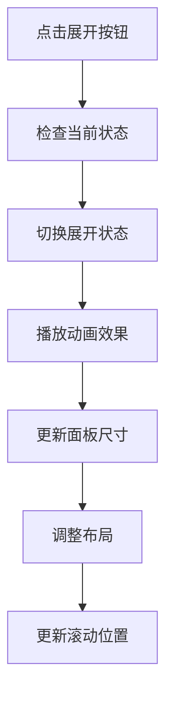
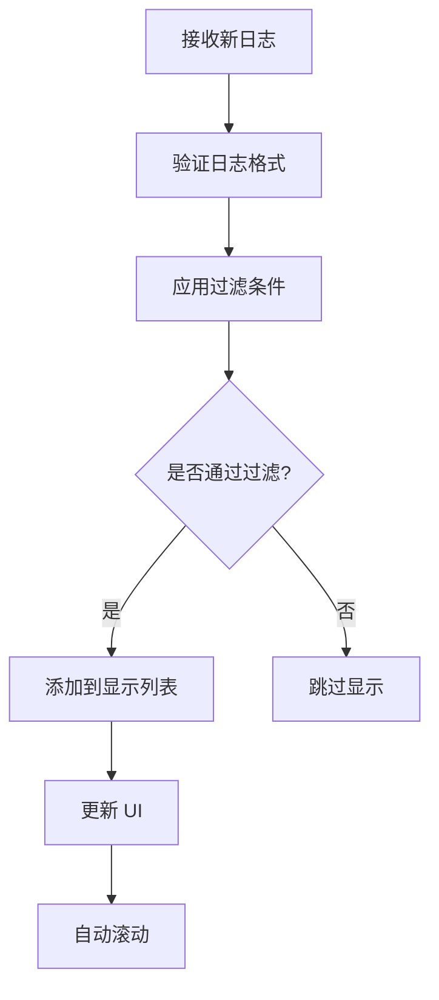
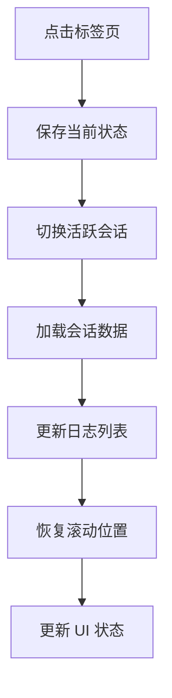

# LogPanel 日志面板组件模块

LogPanel 模块是 QuAIz 应用中负责日志展示和实时反馈的核心 UI 组件模块，为用户提供透明的操作过程展示和调试信息查看功能。该模块采用高性能虚拟化渲染技术，支持大量日志条目的流畅显示。

## 📁 目录结构

```
LogPanel/
├── LogPanelProvider.tsx     # 全局日志面板提供者
├── components/              # 基础 UI 组件
│   ├── BottomControls.tsx   # 底部控制栏
│   ├── CopyButton.tsx       # 复制按钮组件
│   ├── EmptyState.tsx       # 空状态展示
│   ├── FloatingToggle.tsx   # 浮动切换按钮
│   ├── LogEntry.tsx         # 传统日志条目
│   ├── LogPanel.tsx         # 传统日志面板
│   ├── PanelHeader.tsx      # 面板头部
│   ├── StreamSession.tsx    # 流式会话组件
│   └── TabHeader.tsx        # 标签页头部
├── optimized/               # 性能优化组件
│   ├── OptimizedLogEntry.tsx    # 优化的日志条目
│   ├── OptimizedLogPanel.tsx    # 优化的日志面板
│   └── VirtualizedLogList.tsx   # 虚拟化列表
├── hooks/                   # 自定义 Hooks
│   └── useAutoScroll.ts     # 自动滚动逻辑
├── utils/                   # 工具函数和常量
│   ├── constants.ts         # 常量定义
│   └── utils.ts             # 工具函数
├── docs/                    # 文档
│   ├── PERFORMANCE_OPTIMIZATION.md
│   └── DETAILED_PERFORMANCE_OPTIMIZATION.md
├── index.ts                 # 模块统一导出
└── README.md                # 模块文档
```

## 🎯 核心功能

### 1. 高性能日志展示
- **虚拟化渲染**: 支持 1000+ 条日志无卡顿滚动
- **实时更新**: 日志条目的实时添加和更新
- **流式显示**: 支持 AI 流式回复的实时展示
- **智能滚动**: 自动滚动和手动控制的智能切换
- **状态指示**: 清晰的日志状态和类型指示

### 2. 双标签页管理
- **系统日志**: 显示应用运行日志和操作记录
- **流式回复**: 专门展示 AI 流式生成内容
- **标签切换**: 流畅的标签页切换体验
- **状态同步**: 标签页状态与内容实时同步
- **计数显示**: 实时显示各标签页的内容数量

### 3. 侧边栏交互
- **挤压布局**: 侧边栏弹出时挤压主内容区域
- **平滑动画**: 300ms 的平滑展开收起动画
- **浮动切换**: 面板关闭时显示浮动开启按钮
- **响应式设计**: 适配不同屏幕尺寸的布局
- **内容复制**: 一键复制日志和会话内容

## 📋 主要组件

### LogPanelProvider - 全局日志面板提供者
- **文件**: `./LogPanelProvider.tsx`
- **功能**: 在应用根级别提供全局日志面板功能
- **特性**:
  - Flex 布局实现挤压效果
  - 全局状态管理集成
  - 优化版日志面板集成
  - 平滑的布局过渡动画
  - 响应式布局适配

### OptimizedLogPanel - 优化版日志面板
- **文件**: `./optimized/OptimizedLogPanel.tsx`
- **功能**: 集成虚拟化滚动和性能优化的主面板
- **特性**:
  - 虚拟化列表渲染
  - 智能自动滚动
  - 双标签页管理
  - 性能优化的事件处理
  - 内存管理和清理

### VirtualizedLogList - 虚拟化日志列表
- **文件**: `./optimized/VirtualizedLogList.tsx`
- **功能**: 高性能的虚拟化日志列表组件
- **特性**:
  - react-window 虚拟化
  - 动态高度计算
  - 大量数据渲染优化
  - 平滑滚动体验
  - 内存使用优化

### LogEntry - 日志条目组件
- **文件**: `./components/LogEntry.tsx`
- **功能**: 单个日志条目的渲染组件
- **特性**:
  - 多种日志类型支持
  - 时间戳格式化
  - 内容语法高亮
  - 展开/收起详情
  - 状态图标显示

### StreamSession - 流式会话组件
- **文件**: `./components/StreamSession.tsx`
- **功能**: 显示 AI 流式回复的会话组件
- **特性**:
  - 流式内容实时渲染
  - 会话状态指示
  - 内容片段管理
  - 展开/收起切换
  - 持续时间计算

### TabHeader - 标签页头部
- **文件**: `./components/TabHeader.tsx`
- **功能**: 双标签页的头部导航组件
- **特性**:
  - 系统日志/流式回复切换
  - 活跃状态指示
  - 内容计数显示
  - 平滑切换动画
  - 响应式设计

### PanelHeader - 面板头部
- **文件**: `./components/PanelHeader.tsx`
- **功能**: 日志面板的头部工具栏
- **特性**:
  - 面板标题和计数显示
  - 清空当前标签内容
  - 关闭面板按钮
  - 工具栏布局
  - 状态指示器

## 🔧 工具组件

### BottomControls - 底部控制栏
- **文件**: `./components/BottomControls.tsx`
- **功能**: 面板底部的控制工具栏
- **特性**:
  - 自动滚动状态指示
  - 滚动到底部按钮
  - 控制栏布局管理
  - 状态图标显示
  - 交互反馈

### FloatingToggle - 浮动切换按钮
- **文件**: `./components/FloatingToggle.tsx`
- **功能**: 面板关闭时的浮动开启按钮
- **特性**:
  - 固定在页面左侧
  - 悬浮动画效果
  - 点击展开面板
  - 视觉提示设计
  - 响应式定位

### CopyButton - 复制按钮
- **文件**: `./components/CopyButton.tsx`
- **功能**: 一键复制文本内容到剪贴板
- **特性**:
  - 复制成功提示
  - 错误处理
  - 图标状态切换
  - 无障碍支持
  - 兼容性处理

### EmptyState - 空状态展示
- **文件**: `./components/EmptyState.tsx`
- **功能**: 无内容时的占位显示组件
- **特性**:
  - 不同标签页的空状态
  - 友好的提示信息
  - 图标和文字组合
  - 居中布局设计
  - 视觉层次清晰

## 🎮 自定义 Hooks

### useAutoScroll - 自动滚动逻辑
- **文件**: `./hooks/useAutoScroll.ts`
- **功能**: 管理日志面板的智能自动滚动逻辑
- **提供功能**:
  - `scrollRef` - 滚动容器的 ref 引用
  - `isAutoScroll` - 当前自动滚动状态
  - `handleScroll` - 滚动事件处理函数
  - `forceScrollToBottom` - 强制滚动到底部
- **特性**:
  - 智能检测用户滚动行为
  - 自动滚动状态的动态切换
  - 依赖数组变化时自动滚动
  - 防抖处理避免频繁更新
  - 滚动位置的精确控制

## 🛠️ 工具函数和常量

### constants.ts - 常量定义
- **功能**: 日志面板相关的常量定义
- **包含内容**:
  - 日志类型常量
  - 面板尺寸配置
  - 动画时长设置
  - 颜色主题定义
  - 默认配置参数

### utils.ts - 工具函数
- **功能**: 日志面板的通用工具函数
- **提供方法**:
  - 时间格式化函数
  - 文本处理工具
  - 状态判断函数
  - 样式类名生成
  - 数据转换工具

## 🎨 设计特点

### 视觉设计
- **现代界面**: 现代化的 UI 设计风格
- **色彩编码**: 使用颜色区分不同日志类型
- **图标语言**: 直观的图标和状态指示
- **动画效果**: 平滑的展开收起动画

### 用户体验
- **即时反馈**: 实时的日志更新和状态反馈
- **操作便捷**: 便捷的操作和快捷键支持
- **信息层次**: 清晰的信息层次和优先级
- **错误处理**: 友好的错误提示和处理

### 性能优化
- **虚拟滚动**: 大量日志时的虚拟滚动
- **懒加载**: 按需加载日志详情
- **内存管理**: 自动清理过期日志
- **渲染优化**: 避免不必要的重新渲染

## 🔄 交互流程

### 面板展开流程


### 日志添加流程


### 会话切换流程


## 📊 数据结构

### 面板状态结构
```typescript
interface LogPanelState {
  isExpanded: boolean;
  activeTabId: string;
  tabs: LogTab[];
  position: 'bottom' | 'right' | 'floating';
  size: { width: number; height: number };
}
```

### 标签页结构
```typescript
interface LogTab {
  id: string;
  title: string;
  type: 'general' | 'generation' | 'grading';
  sessionId?: string;
  isActive: boolean;
  hasNewLogs: boolean;
  logCount: number;
}
```

### 显示日志结构
```typescript
interface DisplayLogEntry {
  id: string;
  timestamp: number;
  type: 'info' | 'warning' | 'error' | 'debug';
  level: 'low' | 'medium' | 'high' | 'critical';
  message: string;
  formattedMessage?: string;
  isExpanded?: boolean;
  metadata?: Record<string, unknown>;
}
```

## 🎮 交互特性

### 键盘快捷键
- **Ctrl/Cmd + L**: 切换日志面板
- **Ctrl/Cmd + F**: 打开搜索
- **Ctrl/Cmd + E**: 导出日志
- **Esc**: 关闭搜索或面板
- **Tab**: 在标签页间切换

### 鼠标交互
- **双击**: 展开/收起日志详情
- **右键**: 显示上下文菜单
- **拖拽**: 调整面板大小
- **滚轮**: 滚动日志列表

### 触摸支持
- **滑动**: 在标签页间滑动切换
- **长按**: 显示更多操作选项
- **双击**: 展开/收起详情
- **捏合**: 调整字体大小

## 📱 响应式适配

### 桌面端 (lg+)
- **侧边面板**: 可停靠的侧边面板模式
- **多标签**: 完整的多标签页功能
- **工具栏**: 完整的工具栏和操作按钮
- **拖拽**: 支持面板拖拽和调整大小

### 平板端 (md-lg)
- **浮动面板**: 浮动的日志面板
- **简化工具栏**: 简化的工具栏
- **触摸优化**: 适合触摸的按钮大小
- **自适应**: 根据屏幕方向调整布局

### 移动端 (< md)
- **全屏模式**: 全屏的日志查看模式
- **底部面板**: 底部滑出的面板
- **简化界面**: 简化的用户界面
- **手势操作**: 支持手势操作

## 🔗 集成方式

### 全局日志面板提供者
```typescript
import { LogPanelProvider } from '@/components/LogPanel';

const App = () => {
  return (
    <LogPanelProvider>
      <Router>
        {/* 应用路由 */}
      </Router>
    </LogPanelProvider>
  );
};
```

### 在页面中使用日志
```typescript
import { useLogPanel } from '@/components/LogPanel';

const GenerationPage = () => {
  const { addLog, showPanel } = useLogPanel();
  
  const handleGenerate = async () => {
    addLog({
      type: 'info',
      message: '开始生成题目'
    });
    
    showPanel(); // 显示日志面板
    
    try {
      // 生成逻辑
    } catch (error) {
      addLog({
        type: 'error',
        message: '生成失败',
        metadata: { error }
      });
    }
  };
  
  return (
    <div>
      {/* 页面内容 */}
    </div>
  );
};
```

### 自定义日志格式化
```typescript
import { registerLogFormatter } from '@/components/LogPanel';

// 注册自定义格式化器
registerLogFormatter('api-call', (log) => {
  return {
    ...log,
    formattedMessage: `🌐 API: ${log.message}`,
    icon: 'api',
    color: 'blue'
  };
});
```

## 🔗 相关模块

- **日志存储**: `../../stores/logStore/` - 日志数据存储和管理
- **主应用**: `../LogPanelProvider.tsx` - 全局日志面板提供者
- **生成页面**: `../../pages/generation/` - 题目生成过程日志
- **答题页面**: `../../pages/quiz/` - 答题过程日志
- **结果页面**: `../../pages/result/` - 批改过程日志

## 🚀 性能优化

### 渲染优化
- **虚拟滚动**: 大量日志时使用虚拟滚动
- **组件缓存**: 缓存日志条目组件
- **懒加载**: 按需加载日志详情
- **防抖**: 搜索和过滤的防抖处理

### 内存管理
- **日志限制**: 限制内存中的日志数量
- **自动清理**: 自动清理过期日志
- **分页加载**: 历史日志的分页加载
- **压缩存储**: 压缩存储大量日志数据

### 网络优化
- **批量更新**: 批量处理日志更新
- **增量同步**: 增量同步日志数据
- **离线支持**: 离线状态下的日志缓存
- **重连机制**: 网络断开后的重连机制

## 🛠️ 开发工具

### 调试功能
- **日志级别**: 可调节的日志级别
- **调试模式**: 开发环境的调试模式
- **性能监控**: 日志面板的性能监控
- **错误追踪**: 错误的详细追踪信息

### 配置选项
- **主题设置**: 可配置的主题和样式
- **布局设置**: 可调整的布局和位置
- **过滤设置**: 可保存的过滤配置
- **导出设置**: 可配置的导出选项

## 👨‍💻 开发者

- **作者**: JacksonHe04
- **项目**: QuAIz - AI 智能刷题系统
- **模块**: 日志展示和实时反馈核心 UI 组件