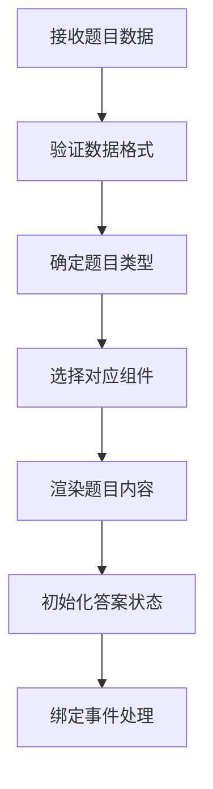
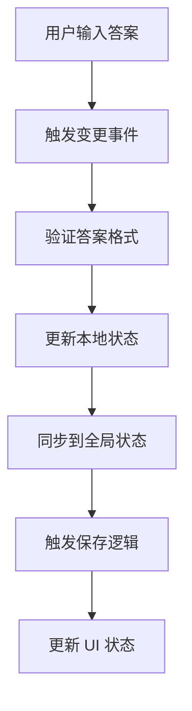
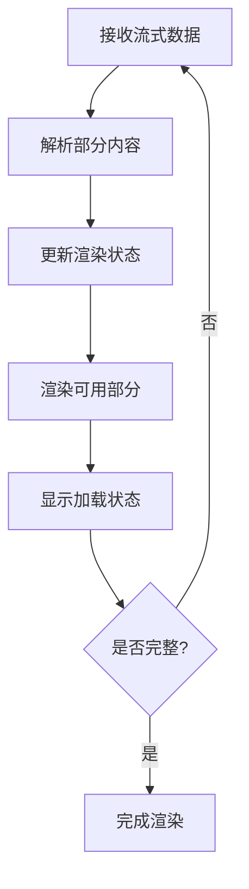

# Question 题目组件模块

Question 模块是 QGen 应用中负责题目渲染和交互的核心组件模块，提供多种题型的统一渲染接口和丰富的交互功能。

## 📁 目录结构

```
Question/
├── QuestionRenderer.tsx           # 题目渲染器（主组件）
├── StreamingQuestionRenderer.tsx  # 流式题目渲染器
├── questions/                     # 具体题型组件
│   ├── CodeOutputQuestion.tsx    # 代码输出题
│   ├── CodeWritingQuestion.tsx   # 代码编写题
│   ├── FillInBlankQuestion.tsx   # 填空题
│   ├── MultipleChoiceQuestion.tsx # 多选题
│   ├── ShortAnswerQuestion.tsx   # 简答题
│   ├── SingleChoiceQuestion.tsx  # 单选题
│   └── index.ts                  # 题型组件导出
├── hooks/                        # 自定义 Hooks
│   ├── useQuestionState.ts       # 题目状态管理
│   ├── useAnswerValidation.ts    # 答案验证逻辑
│   └── index.ts                  # Hooks 导出
├── utils/                        # 工具函数
│   ├── questionUtils.ts          # 题目工具函数
│   ├── answerUtils.ts            # 答案处理工具
│   └── index.ts                  # 工具导出
└── index.ts                      # 模块统一导出
```

## 🎯 核心功能

### 1. 多题型支持
- **6 种题型**: 单选、多选、填空、简答、代码输出、代码编写
- **统一接口**: 所有题型使用统一的组件接口
- **类型安全**: 完整的 TypeScript 类型支持
- **可扩展**: 易于添加新的题目类型

### 2. 智能渲染
- **动态渲染**: 根据题目类型动态选择渲染组件
- **流式渲染**: 支持题目生成过程中的流式渲染
- **响应式**: 适配不同屏幕尺寸的响应式设计
- **性能优化**: 组件懒加载和渲染优化

### 3. 交互功能
- **实时保存**: 答案变更时的实时保存
- **状态管理**: 完整的答题状态管理
- **验证反馈**: 实时的答案验证和反馈
- **键盘支持**: 完善的键盘导航支持

## 📋 主要组件

### QuestionRenderer - 题目渲染器
- **文件**: `./QuestionRenderer.tsx`
- **功能**: 题目渲染的核心组件
- **特性**:
  - 根据题目类型动态渲染对应组件
  - 统一的题目数据接口
  - 答案状态管理
  - 错误边界处理
  - 性能优化

### StreamingQuestionRenderer - 流式渲染器
- **文件**: `./StreamingQuestionRenderer.tsx`
- **功能**: 支持流式生成的题目渲染器
- **特性**:
  - 部分内容的实时渲染
  - 加载状态显示
  - 渐进式内容展示
  - 生成进度指示

## 🎮 题型组件

### SingleChoiceQuestion - 单选题
- **文件**: `./questions/SingleChoiceQuestion.tsx`
- **功能**: 单选题的渲染和交互
- **特性**:
  - 选项列表渲染
  - 单选逻辑处理
  - 选中状态管理
  - 答案验证

### MultipleChoiceQuestion - 多选题
- **文件**: `./questions/MultipleChoiceQuestion.tsx`
- **功能**: 多选题的渲染和交互
- **特性**:
  - 多选框渲染
  - 多选逻辑处理
  - 选中状态数组管理
  - 最少/最多选择限制

### FillInBlankQuestion - 填空题
- **文件**: `./questions/FillInBlankQuestion.tsx`
- **功能**: 填空题的渲染和交互
- **特性**:
  - 空白位置识别
  - 输入框动态插入
  - 多空格答案管理
  - 实时答案同步

### ShortAnswerQuestion - 简答题
- **文件**: `./questions/ShortAnswerQuestion.tsx`
- **功能**: 简答题的渲染和交互
- **特性**:
  - 多行文本输入
  - 字数统计显示
  - 自动高度调整
  - 格式化支持

### CodeOutputQuestion - 代码输出题
- **文件**: `./questions/CodeOutputQuestion.tsx`
- **功能**: 代码输出题的渲染和交互
- **特性**:
  - 代码语法高亮
  - 输出结果输入
  - 代码执行模拟
  - 多语言支持

### CodeWritingQuestion - 代码编写题
- **文件**: `./questions/CodeWritingQuestion.tsx`
- **功能**: 代码编写题的渲染和交互
- **特性**:
  - 代码编辑器集成
  - 语法高亮和提示
  - 代码格式化
  - 实时语法检查

## 🔧 自定义 Hooks

### useQuestionState - 题目状态管理
- **文件**: `./hooks/useQuestionState.ts`
- **功能**: 管理单个题目的状态
- **提供功能**:
  - `answer` - 当前答案状态
  - `setAnswer()` - 设置答案
  - `isAnswered` - 是否已答题
  - `resetAnswer()` - 重置答案

### useAnswerValidation - 答案验证
- **文件**: `./hooks/useAnswerValidation.ts`
- **功能**: 答案验证和格式检查
- **提供功能**:
  - `validateAnswer()` - 验证答案格式
  - `isValid` - 答案是否有效
  - `errors` - 验证错误信息
  - `warnings` - 验证警告信息

## 🛠️ 工具函数

### questionUtils.ts - 题目工具
- **功能**: 题目相关的工具函数
- **提供方法**:
  - `getQuestionComponent()` - 获取题目组件
  - `validateQuestionData()` - 验证题目数据
  - `formatQuestionText()` - 格式化题目文本
  - `extractQuestionMetadata()` - 提取题目元数据

### answerUtils.ts - 答案工具
- **功能**: 答案处理相关工具函数
- **提供方法**:
  - `formatAnswer()` - 格式化答案
  - `compareAnswers()` - 比较答案
  - `validateAnswerFormat()` - 验证答案格式
  - `serializeAnswer()` - 序列化答案

## 🎨 设计特点

### 组件架构
- **组合模式**: 使用组合模式构建复杂题目
- **插件化**: 题型组件的插件化设计
- **可配置**: 丰富的配置选项支持
- **可测试**: 良好的可测试性设计

### 用户体验
- **即时反馈**: 答案变更的即时反馈
- **状态保持**: 答案状态的自动保持
- **错误提示**: 清晰的错误提示信息
- **无障碍**: 完善的无障碍访问支持

### 性能优化
- **懒加载**: 题型组件的按需加载
- **虚拟化**: 大量题目时的虚拟化渲染
- **缓存**: 答案状态的智能缓存
- **防抖**: 输入防抖优化性能

## 🔄 数据流程

### 题目渲染流程


### 答案处理流程


### 流式渲染流程


## 📊 数据结构

### 题目数据结构
```typescript
interface Question {
  id: string;
  type: QuestionType;
  question: string;
  options?: string[];  // 选择题选项
  correctAnswer?: unknown;
  explanation?: string;
  difficulty: 'easy' | 'medium' | 'hard';
  tags?: string[];
  metadata?: QuestionMetadata;
}
```

### 答案数据结构
```typescript
type Answer = 
  | string              // 单选、填空、简答
  | string[]            // 多选
  | { [key: string]: string }  // 多空填空
  | CodeAnswer;         // 代码题

interface CodeAnswer {
  code: string;
  language: string;
  output?: string;
}
```

### 题目状态结构
```typescript
interface QuestionState {
  questionId: string;
  answer?: Answer;
  isAnswered: boolean;
  isValid: boolean;
  lastModified: number;
  validationErrors?: string[];
}
```

## 🎮 交互特性

### 键盘导航
- **Tab 导航**: 支持 Tab 键在选项间导航
- **方向键**: 支持方向键选择选项
- **快捷键**: 支持数字键快速选择
- **回车确认**: 支持回车键确认选择

### 鼠标交互
- **点击选择**: 支持鼠标点击选择
- **拖拽排序**: 支持拖拽排序（如适用）
- **悬停效果**: 丰富的鼠标悬停效果
- **右键菜单**: 上下文相关的右键菜单

### 触摸支持
- **触摸选择**: 支持触摸设备的选择操作
- **滑动切换**: 支持滑动切换题目
- **长按操作**: 支持长按显示更多选项
- **手势识别**: 基本的手势识别支持

## 📱 响应式设计

### 桌面端 (lg+)
- **多列布局**: 选项可以多列显示
- **大字体**: 适合阅读的字体大小
- **丰富交互**: 完整的鼠标和键盘交互

### 平板端 (md-lg)
- **适中布局**: 平衡的布局设计
- **触摸优化**: 适合触摸的按钮大小
- **自适应**: 根据屏幕方向调整布局

### 移动端 (< md)
- **单列布局**: 垂直堆叠的选项布局
- **大按钮**: 适合触摸的大按钮
- **简化界面**: 简化的用户界面

## 🔗 集成方式

### 在答题页面中使用
```typescript
import { QuestionRenderer } from '@/components/Question';

const QuizPage = () => {
  const { questions, currentIndex } = useQuizStore();
  const currentQuestion = questions[currentIndex];
  
  return (
    <div>
      <QuestionRenderer
        question={currentQuestion}
        onAnswerChange={(answer) => {
          // 处理答案变更
        }}
      />
    </div>
  );
};
```

### 在流式页面中使用
```typescript
import { StreamingQuestionRenderer } from '@/components/Question';

const StreamingQuizPage = () => {
  const { partialQuestions } = useGenerationStore();
  
  return (
    <div>
      {partialQuestions.map((question, index) => (
        <StreamingQuestionRenderer
          key={question.id}
          question={question}
          isComplete={question.isComplete}
          onAnswerChange={(answer) => {
            // 处理答案变更
          }}
        />
      ))}
    </div>
  );
};
```

### 自定义题型组件
```typescript
import { QuestionComponentProps } from '@/components/Question/types';

const CustomQuestion: React.FC<QuestionComponentProps> = ({
  question,
  answer,
  onAnswerChange,
  disabled
}) => {
  return (
    <div>
      <h3>{question.question}</h3>
      {/* 自定义题目内容 */}
    </div>
  );
};

// 注册自定义题型
registerQuestionType('custom', CustomQuestion);
```

## 🔗 相关模块

- **答题页面**: `../../pages/quiz/` - 题目展示和答题界面
- **结果页面**: `../../pages/result/` - 答题结果展示
- **状态管理**: `../../stores/` - 答题状态管理
- **类型定义**: `../../types/` - 共享类型定义
- **工具函数**: `../../utils/` - 通用工具函数

## 🚀 最佳实践

### 组件开发
- **单一职责**: 每个组件只负责一种题型
- **接口统一**: 使用统一的组件接口
- **状态隔离**: 组件状态与全局状态分离
- **错误处理**: 完善的错误边界处理

### 性能优化
- **按需加载**: 只加载当前需要的题型组件
- **状态缓存**: 合理缓存答案状态
- **渲染优化**: 避免不必要的重新渲染
- **内存管理**: 及时清理不需要的状态

### 用户体验
- **即时反馈**: 提供即时的操作反馈
- **状态保持**: 保持用户的答题状态
- **错误提示**: 清晰的错误提示信息
- **无障碍**: 支持屏幕阅读器等辅助工具

## 👨‍💻 开发者

- **作者**: JacksonHe04
- **项目**: QGen - AI 智能刷题系统
- **模块**: 题目渲染和交互核心组件