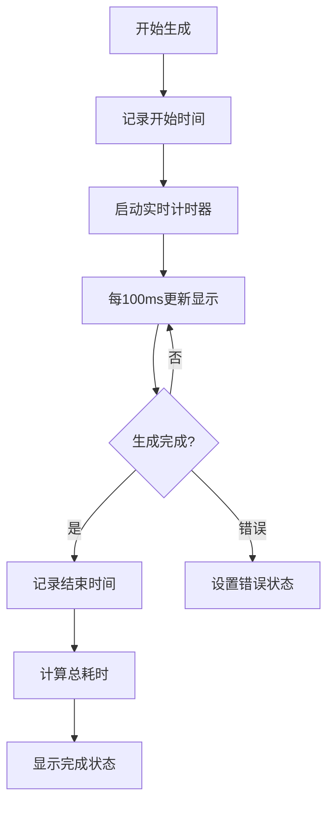
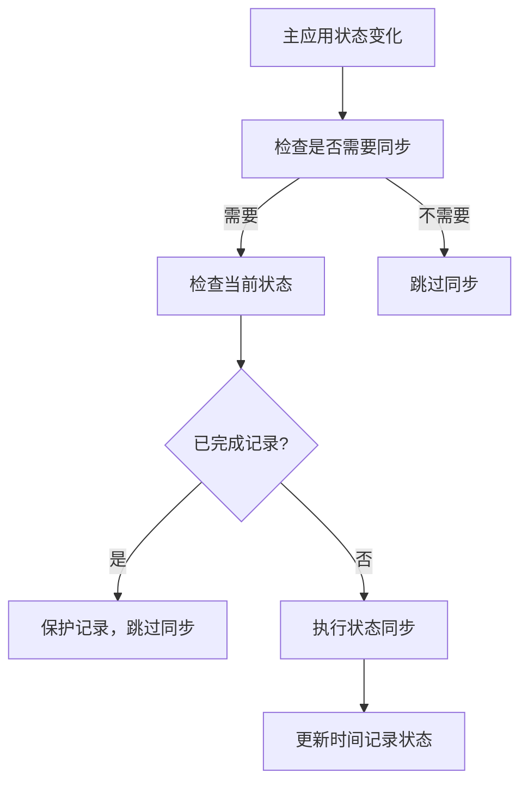
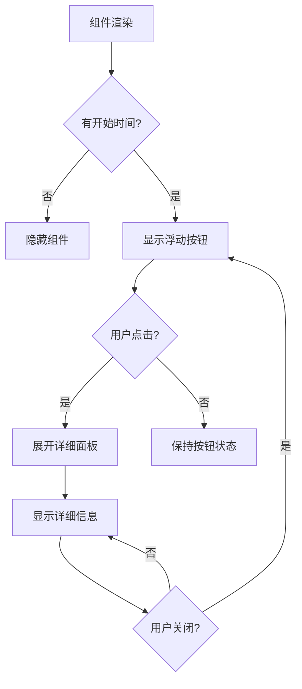

# TimeRecorder 时间记录组件模块

TimeRecorder 模块是 QuAIz 应用中负责记录和显示题目生成时间的核心组件模块，为用户提供透明的生成过程时间反馈和性能监控功能。

## 📁 目录结构

```
TimeRecorder/
├── TimeRecorder.tsx                    # 基础时间记录组件
├── FloatingTimeRecorder.tsx             # 浮动时间记录组件
├── OptimizedFloatingTimeRecorder.tsx    # 优化版浮动时间记录组件
└── index.ts                             # 模块统一导出
```

## 🎯 核心功能

### 1. 实时时间记录
- **精确计时**: 毫秒级精度的时间记录
- **实时更新**: 生成过程中的实时时间显示
- **状态同步**: 与生成状态完全同步
- **性能监控**: 提供生成性能评估

### 2. 多种显示模式
- **基础组件**: 简单的时间信息展示
- **浮动组件**: 页面浮动的时间记录器
- **优化版本**: 独立状态管理的优化实现
- **响应式设计**: 适配不同屏幕尺寸

### 3. 状态管理集成
- **独立状态**: 避免重渲染导致的状态丢失
- **状态同步**: 与主应用状态智能同步
- **持久化**: 状态在页面跳转时保持
- **错误处理**: 完善的错误状态管理

## 📋 主要组件

### TimeRecorder - 基础时间记录组件
- **文件**: `./TimeRecorder.tsx`
- **功能**: 基础的时间记录信息展示组件
- **特性**:
  - 状态图标和文本显示
  - 实时耗时计算
  - 详细信息展开
  - 性能评估提示
  - 自定义样式支持

#### 组件属性
```typescript
interface TimeRecorderProps {
  /** 开始时间戳（毫秒） */
  startTime?: number;
  /** 结束时间戳（毫秒） */
  endTime?: number;
  /** 总耗时（毫秒） */
  duration?: number;
  /** 当前状态 */
  status: 'idle' | 'generating' | 'complete' | 'error';
  /** 是否显示详细信息 */
  showDetails?: boolean;
  /** 自定义样式类名 */
  className?: string;
}
```

#### 功能特性
- **状态指示**: 不同状态的图标和颜色
- **实时计时**: 生成中状态的实时时间更新
- **详细信息**: 开始时间、结束时间、总耗时
- **性能提示**: 根据耗时提供性能评估

### FloatingTimeRecorder - 浮动时间记录组件
- **文件**: `./FloatingTimeRecorder.tsx`
- **功能**: 页面右侧的浮动时间记录器
- **特性**:
  - 浮动按钮触发
  - 展开详细面板
  - 实时状态更新
  - 响应式设计
  - 自动隐藏机制

#### 设计特点
- **浮动按钮**: 右侧固定位置的圆形/半圆形按钮
- **状态颜色**: 根据生成状态变化按钮颜色
- **展开面板**: 点击后展开详细信息面板
- **自动隐藏**: 无开始时间时自动隐藏

### OptimizedFloatingTimeRecorder - 优化版浮动组件
- **文件**: `./OptimizedFloatingTimeRecorder.tsx`
- **功能**: 使用独立状态管理的优化版本
- **特性**:
  - 独立状态管理
  - 避免状态丢失
  - 性能优化
  - 智能同步
  - 通用组件复用

#### 优化特性
- **独立状态**: 使用 `useTimeRecorderStore` 独立管理状态
- **智能同步**: 只在关键状态变化时同步
- **性能优化**: 减少不必要的重渲染
- **状态保持**: 页面跳转时保持时间记录
- **组件复用**: 使用通用的 FloatingButton 和 FloatingPanel

## 🔧 状态管理

### TimeRecorderStore - 独立状态管理
- **文件**: `../../stores/timeRecorderStore.ts`
- **功能**: 时间记录的独立状态管理
- **特性**:
  - 完整的时间记录状态
  - 实时更新机制
  - 状态同步函数
  - 面板展开控制

#### 状态结构
```typescript
interface TimeRecorderState {
  /** 开始时间 */
  startTime: number | null;
  /** 结束时间 */
  endTime: number | null;
  /** 总耗时 */
  duration: number | null;
  /** 当前状态 */
  status: 'idle' | 'generating' | 'completed' | 'error';
  /** 实时耗时（用于生成中状态） */
  currentDuration: number;
  /** 是否展开详细面板 */
  isExpanded: boolean;
}
```

#### 操作方法
```typescript
interface TimeRecorderActions {
  /** 开始计时 */
  startTiming: () => void;
  /** 结束计时 */
  endTiming: () => void;
  /** 设置错误状态 */
  setError: () => void;
  /** 重置状态 */
  reset: () => void;
  /** 更新实时耗时 */
  updateCurrentDuration: (duration: number) => void;
  /** 切换展开状态 */
  toggleExpanded: () => void;
  /** 设置展开状态 */
  setExpanded: (expanded: boolean) => void;
}
```

### 状态同步机制
```typescript
/**
 * 同步主应用状态到时间记录状态
 * 避免重复同步和状态冲突，优化性能
 */
export const syncTimeRecorderWithAppState = (generationState: {
  status: string;
  startTime?: number;
  endTime?: number;
  duration?: number;
}) => {
  // 智能同步逻辑
  // 避免相同状态的重复同步
  // 保护已完成的记录不被覆盖
};
```

## 🎨 设计特点

### 状态可视化
- **状态图标**:
  - `⏳` 生成中 (蓝色)
  - `✓` 已完成 (绿色)
  - `✕` 生成失败 (红色)
  - `⏰` 等待中 (灰色)

- **状态颜色**:
  - 生成中: `bg-blue-600`
  - 已完成: `bg-green-600`
  - 生成失败: `bg-red-600`
  - 等待中: `bg-gray-600`

### 响应式设计
- **桌面端 (lg+)**:
  - 圆形浮动按钮 (12x12)
  - 固定宽度面板 (w-72)
  - 距离边缘 16px

- **移动端 (< lg)**:
  - 半圆形浮动按钮 (8x16)
  - 适配宽度面板
  - 距离边缘 8px

### 性能提示
根据生成耗时提供不同的性能评估：
- **< 5秒**: ⚡ 生成速度很快！(绿色)
- **5-15秒**: ⏱️ 生成速度正常 (黄色)
- **> 15秒**: 🐌 生成耗时较长，可考虑优化 (红色)

## 🔄 工作流程

### 时间记录流程


### 状态同步流程


### 组件显示逻辑


## 🔧 使用方式

### 基础时间记录组件
```typescript
import { TimeRecorder } from '@/components/TimeRecorder';

const GenerationPage = () => {
  const { generation } = useAppStore();
  
  return (
    <div>
      <TimeRecorder
        startTime={generation.startTime}
        endTime={generation.endTime}
        duration={generation.duration}
        status={generation.status}
        showDetails={true}
      />
    </div>
  );
};
```

### 浮动时间记录组件
```typescript
import { FloatingTimeRecorder } from '@/components/TimeRecorder';

const App = () => {
  return (
    <div>
      {/* 页面内容 */}
      <FloatingTimeRecorder />
    </div>
  );
};
```

### 优化版浮动组件（推荐）
```typescript
import { OptimizedFloatingTimeRecorder } from '@/components/TimeRecorder';

const GenerationPage = () => {
  return (
    <div>
      {/* 页面内容 */}
      <OptimizedFloatingTimeRecorder />
    </div>
  );
};
```

### 自定义样式
```typescript
<TimeRecorder
  startTime={startTime}
  status={status}
  className="bg-blue-50 border-blue-200"
  showDetails={true}
/>
```

## 🎮 实际应用场景

### 1. 题目生成页面
- **位置**: `pages/generation/index.tsx`
- **组件**: `OptimizedFloatingTimeRecorder`
- **功能**: 显示题目生成过程的时间记录
- **特性**: 实时更新，状态同步

### 2. 流式生成页面
- **位置**: `pages/quiz/streaming.tsx`
- **组件**: 浮动时间记录器
- **功能**: 在流式生成过程中显示时间
- **特性**: 与生成进度同步

### 3. 性能监控
- **用途**: 监控 AI 生成性能
- **指标**: 生成耗时、成功率
- **反馈**: 性能优化建议

## 📊 性能优化

### 更新频率优化
- **基础组件**: 每 50ms 更新一次
- **优化组件**: 每 100ms 更新一次
- **状态同步**: 只在关键状态变化时同步
- **渲染优化**: 避免不必要的重新渲染

### 内存管理
- **定时器清理**: 组件卸载时清理定时器
- **状态清理**: 适时清理过期状态
- **事件监听**: 正确管理事件监听器

### 状态同步优化
```typescript
// 避免频繁同步
if (currentTimeState.status === generationState.status) {
  return; // 跳过相同状态的同步
}

// 保护已完成的记录
if (currentTimeState.status === 'completed' && currentTimeState.startTime) {
  return; // 不覆盖已完成的记录
}

// 减少状态更新频率
if (Math.abs(duration - currentState.currentDuration) > 50) {
  set({ currentDuration: duration }); // 只在差异超过 50ms 时更新
}
```

## 🛠️ 工具函数

### 时间格式化
- **文件**: `../../utils/timeUtils.ts`
- **函数**:
  - `formatDuration()` - 格式化持续时间
  - `formatDurationPrecise()` - 精确格式化
  - `formatTimestamp()` - 格式化时间戳

### 状态判断
```typescript
/**
 * 获取显示的耗时
 */
const getDisplayDuration = () => {
  if (status === 'generating' && startTime) {
    return currentDuration;
  }
  return duration || 0;
};

/**
 * 获取状态信息
 */
const getStatusInfo = () => {
  switch (status) {
    case 'generating':
      return { 
        icon: '⏳', 
        color: 'bg-blue-600', 
        hoverColor: 'hover:bg-blue-700',
        text: '生成中' 
      };
    case 'completed':
      return { 
        icon: '✓', 
        color: 'bg-green-600', 
        hoverColor: 'hover:bg-green-700',
        text: '已完成' 
      };
    case 'error':
      return { 
        icon: '✕', 
        color: 'bg-red-600', 
        hoverColor: 'hover:bg-red-700',
        text: '生成失败' 
      };
    default:
      return { 
        icon: '⏰', 
        color: 'bg-gray-600', 
        hoverColor: 'hover:bg-gray-700',
        text: '等待中' 
      };
  }
};
```

## 🧪 测试支持

### 测试文件
- **文件**: `../../test/timeRecorderTest.ts`
- **功能**: 时间记录状态测试
- **用途**: 调试状态同步问题

### 测试函数
```typescript
// 在浏览器控制台中运行
timeRecorderTest.runAllTests();
timeRecorderTest.testTimeRecorderStateTransition();
timeRecorderTest.testComponentDisplayLogic();
```

### 常见问题测试
- **状态丢失**: 测试页面跳转后状态保持
- **同步问题**: 测试状态同步机制
- **显示逻辑**: 测试组件显示/隐藏逻辑

## 🔗 相关模块

- **浮动按钮**: `../FloatingButton/` - 提供浮动 UI 组件
- **状态管理**: `../../stores/timeRecorderStore.ts` - 独立状态管理
- **主状态**: `../../stores/useAppStore.ts` - 主应用状态
- **工具函数**: `../../utils/timeUtils.ts` - 时间处理工具
- **生成页面**: `../../pages/generation/` - 主要使用场景

## 🚀 最佳实践

### 组件选择
- **基础展示**: 使用 `TimeRecorder`
- **浮动显示**: 使用 `FloatingTimeRecorder`
- **生产环境**: 推荐使用 `OptimizedFloatingTimeRecorder`

### 性能优化
- **减少更新频率**: 根据需要调整更新间隔
- **状态保护**: 保护已完成的时间记录
- **内存管理**: 及时清理定时器和监听器

### 用户体验
- **状态反馈**: 提供清晰的状态指示
- **性能提示**: 根据耗时给出优化建议
- **响应式**: 适配不同设备和屏幕

## 👨‍💻 开发者

- **作者**: JacksonHe04
- **项目**: QuAIz - AI 智能刷题系统
- **模块**: 时间记录和性能监控核心组件
- **设计理念**: 精确计时、状态同步、性能优化