# Pages 页面模块

本目录包含 QGen 应用的所有页面组件，负责应用的主要功能界面。

## 📁 目录结构

```
pages/
├── auth/               # 登录/注册页面
├── course/             # 课程与知识点管理
├── exam/               # 考试管理（教师/学生）
├── generation/          # 题目生成页面
├── question-bank/      # 题库管理
├── quiz/               # 答题页面
├── result/             # 批改结果页面
└── index.ts            # 页面模块统一导出
```

## 🎯 功能概述

### 1. Generation 题目生成页面
- **路径**: `./generation/`
- **功能**: 用户配置生成参数并提交生成请求
- **主要组件**: GenerationPage
- **核心特性**:
  - 学科/主题配置
  - 题型选择和数量设置
  - 预设方案管理
  - 表单验证和提交

### 2. Quiz 答题页面
- **路径**: `./quiz/`
- **功能**: 用户进行答题操作
- **主要组件**: QuizPage, StreamingQuizPage
- **核心特性**:
  - 题目导航和切换
  - 答案录入和保存
  - 流式题目渲染
  - 答题进度跟踪

### 3. Result 批改结果页面
- **路径**: `./result/`
- **功能**: 显示 AI 批改结果和详细解析
- **主要组件**: ResultPage
- **核心特性**:
  - 成绩统计和分析
  - 题目详细解析
  - 学习建议生成
  - 结果打印和导出

## 🔄 页面流程

```mermaid
graph LR
    A[登录/注册] --> B[仪表盘]
    B --> C[AI 出题]
    C --> D[答题页面]
    D --> E[批改结果]
    B --> F[题库管理]
    B --> G[考试管理]
```



1. **登录阶段**: 用户在 Login/Register 页面完成认证
2. **仪表盘**: 登录后默认进入 Dashboard（可从侧边栏进入各模块）
3. **出题闭环**: Generation → Quiz → Result（由状态机驱动）
4. **考试闭环**: Exams → TakeExam（倒计时提交）
5. **题库管理**: QuestionBank 题目 CRUD、导入导出

## 🔗 URL 路径约定

应用使用 History API 同步 URL（无 React Router）：

- `/login`、`/register`
- `/dashboard`
- `/courses`
- `/question-bank`
- `/exams`、`/exams/create`、`/exams/:id`、`/exams/:id/take`
- `/generation`、`/quiz`、`/result`（由 `AppRouter` 根据状态自动切换）

## 📋 页面组件说明

### GenerationPage
- **文件**: `./generation/index.tsx`
- **描述**: 题目生成的主页面组件
- **依赖**: useGenerationForm, usePresetManager hooks
- **状态管理**: 通过 useAppStore 管理生成状态

### QuizPage
- **文件**: `./quiz/index.tsx`
- **描述**: 标准答题页面组件
- **特性**: 支持题目导航、答案保存、进度跟踪
- **响应式**: 适配桌面端和移动端

### StreamingQuizPage
- **文件**: `./quiz/streaming.tsx`
- **描述**: 流式试卷页面组件
- **特性**: 实时显示生成中的题目，支持部分内容渲染

### ResultPage
- **文件**: `./result/index.tsx`
- **描述**: 批改结果展示页面
- **功能**: 成绩分析、错题解析、学习建议

## 🎨 设计特点

- **模块化设计**: 每个页面独立管理自己的组件、hooks 和常量
- **响应式布局**: 适配不同屏幕尺寸，提供良好的移动端体验
- **状态管理**: 使用 Zustand 进行全局状态管理
- **类型安全**: 完整的 TypeScript 类型定义
- **用户体验**: 流畅的页面切换和加载状态处理

## 🔗 相关模块

- **组件库**: `../components/` - 共享的 UI 组件
- **状态管理**: `../stores/` - 全局状态管理
- **类型定义**: `../types/` - TypeScript 类型定义
- **路由管理**: `../router/` - 页面路由配置

## 👨‍💻 开发者

- **作者**: JacksonHe04
- **项目**: QGen - AI 智能刷题系统
