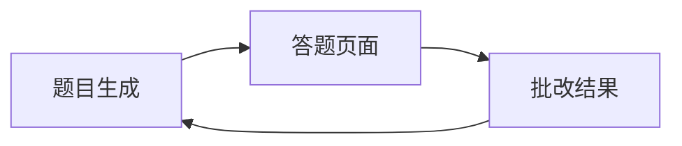

# Pages 页面模块

本目录包含 QGen 应用的所有页面组件，负责应用的主要功能界面。

## 📁 目录结构

```
pages/
├── generation/          # 题目生成页面
├── quiz/               # 答题页面
├── result/             # 批改结果页面
└── index.ts            # 页面模块统一导出
```

## 🎯 功能概述

### 1. Generation 题目生成页面
- **路径**: `./generation/`
- **功能**: 用户配置生成参数并提交生成请求
- **主要组件**: GenerationPage
- **核心特性**:
  - 学科/主题配置
  - 题型选择和数量设置
  - 预设方案管理
  - 表单验证和提交

### 2. Quiz 答题页面
- **路径**: `./quiz/`
- **功能**: 用户进行答题操作
- **主要组件**: QuizPage, StreamingQuizPage
- **核心特性**:
  - 题目导航和切换
  - 答案录入和保存
  - 流式题目渲染
  - 答题进度跟踪

### 3. Result 批改结果页面
- **路径**: `./result/`
- **功能**: 显示 AI 批改结果和详细解析
- **主要组件**: ResultPage
- **核心特性**:
  - 成绩统计和分析
  - 题目详细解析
  - 学习建议生成
  - 结果打印和导出

## 🔄 页面流程



1. **生成阶段**: 用户在 Generation 页面配置参数，生成个性化试卷
2. **答题阶段**: 用户在 Quiz 页面完成答题，支持实时保存
3. **结果阶段**: 系统在 Result 页面展示批改结果和学习建议

## 📋 页面组件说明

### GenerationPage
- **文件**: `./generation/index.tsx`
- **描述**: 题目生成的主页面组件
- **依赖**: useGenerationForm, usePresetManager hooks
- **状态管理**: 通过 useAppStore 管理生成状态

### QuizPage
- **文件**: `./quiz/index.tsx`
- **描述**: 标准答题页面组件
- **特性**: 支持题目导航、答案保存、进度跟踪
- **响应式**: 适配桌面端和移动端

### StreamingQuizPage
- **文件**: `./quiz/streaming.tsx`
- **描述**: 流式试卷页面组件
- **特性**: 实时显示生成中的题目，支持部分内容渲染

### ResultPage
- **文件**: `./result/index.tsx`
- **描述**: 批改结果展示页面
- **功能**: 成绩分析、错题解析、学习建议

## 🎨 设计特点

- **模块化设计**: 每个页面独立管理自己的组件、hooks 和常量
- **响应式布局**: 适配不同屏幕尺寸，提供良好的移动端体验
- **状态管理**: 使用 Zustand 进行全局状态管理
- **类型安全**: 完整的 TypeScript 类型定义
- **用户体验**: 流畅的页面切换和加载状态处理

## 🔗 相关模块

- **组件库**: `../components/` - 共享的 UI 组件
- **状态管理**: `../stores/` - 全局状态管理
- **类型定义**: `../types/` - TypeScript 类型定义
- **路由管理**: `../router/` - 页面路由配置

## 👨‍💻 开发者

- **作者**: JacksonHe04
- **项目**: QGen - AI 智能刷题系统