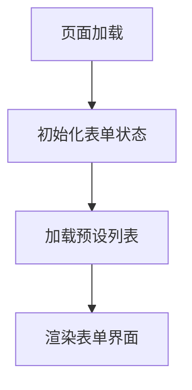
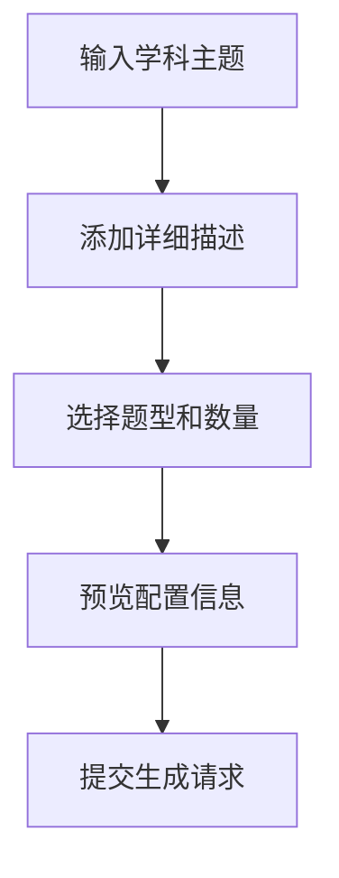
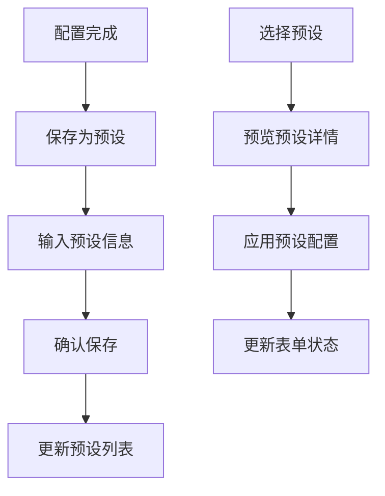

# Generation 题目生成页面

题目生成页面是 QGen 应用的核心功能模块，用户在此页面配置生成参数并提交生成请求，获得个性化的 AI 生成试卷。

## 📁 目录结构

```
generation/
├── components/              # 页面组件
│   ├── GenerationForm.tsx  # 生成表单组件
│   ├── GenerationPreview.tsx # 生成预览组件
│   ├── PresetModal.tsx     # 预设选择模态框
│   ├── QuestionTypeSelector.tsx # 题型选择器
│   ├── SavePresetModal.tsx # 保存预设模态框
│   └── index.ts            # 组件导出
├── constants/              # 常量定义
│   └── index.ts           # 题型选项配置
├── hooks/                  # 自定义 Hooks
│   ├── useGenerationForm.ts # 表单状态管理
│   ├── usePresetManager.ts  # 预设管理
│   └── index.ts            # Hooks 导出
└── index.tsx               # 页面主组件
```

## 🎯 核心功能

### 1. 智能题目生成
- **AI 驱动**: 基于大语言模型生成个性化题目
- **多题型支持**: 支持 6 种不同类型的题目
- **自定义配置**: 灵活的参数配置和数量控制
- **流式生成**: 实时显示生成进度和部分内容

### 2. 预设方案管理
- **快速配置**: 保存和加载常用的生成配置
- **方案分享**: 支持预设方案的导入导出
- **智能命名**: 自动生成预设方案名称
- **批量管理**: 预设方案的批量操作

### 3. 表单验证和提交
- **实时验证**: 表单字段的实时验证反馈
- **错误处理**: 完善的错误提示和处理机制
- **状态管理**: 生成过程的状态跟踪
- **用户体验**: 流畅的交互和加载状态

## 📋 主要组件

### GenerationPage - 主页面组件
- **文件**: `./index.tsx`
- **功能**: 题目生成的主页面容器
- **特性**:
  - 整合表单、预设管理和生成逻辑
  - 响应式布局设计
  - 状态管理集成
  - 错误边界处理

### GenerationForm - 生成表单
- **文件**: `./components/GenerationForm.tsx`
- **功能**: 核心的参数配置表单
- **包含字段**:
  - 学科/主题输入
  - 详细描述文本域
  - 题型选择和数量配置
  - 预设操作按钮

### QuestionTypeSelector - 题型选择器
- **文件**: `./components/QuestionTypeSelector.tsx`
- **功能**: 题型选择和数量配置
- **支持题型**:
  - 单选题 (Single Choice)
  - 多选题 (Multiple Choice)
  - 填空题 (Fill Blank)
  - 简答题 (Short Answer)
  - 代码输出题 (Code Output)
  - 代码编写题 (Code Writing)

### PresetModal - 预设选择模态框
- **文件**: `./components/PresetModal.tsx`
- **功能**: 预设方案的选择和管理
- **特性**:
  - 预设列表展示
  - 预设详情预览
  - 应用和删除操作
  - 搜索和筛选功能

### SavePresetModal - 保存预设模态框
- **文件**: `./components/SavePresetModal.tsx`
- **功能**: 保存当前配置为预设方案
- **特性**:
  - 预设名称和描述输入
  - 配置信息预览
  - 重复名称检查
  - 保存确认流程

## 🔧 自定义 Hooks

### useGenerationForm - 表单状态管理
- **文件**: `./hooks/useGenerationForm.ts`
- **功能**: 管理生成表单的状态和操作
- **提供方法**:
  - `handleSubjectChange()` - 学科/主题变更
  - `handleDescriptionChange()` - 描述变更
  - `handleQuestionConfigChange()` - 题型配置变更
  - `getTotalQuestions()` - 获取总题目数
  - `getQuestionCount()` - 获取指定题型数量

### usePresetManager - 预设管理
- **文件**: `./hooks/usePresetManager.ts`
- **功能**: 管理预设方案的加载、保存和删除
- **提供方法**:
  - `loadPresets()` - 加载预设列表
  - `applyPreset()` - 应用预设方案
  - `handleSavePreset()` - 保存预设方案
  - `confirmSavePreset()` - 确认保存操作
  - `handleDeletePreset()` - 删除预设方案

## ⚙️ 配置和常量

### 题型选项配置
- **文件**: `./constants/index.ts`
- **内容**: QUESTION_TYPE_OPTIONS 数组
- **包含信息**:
  - 题型类型标识
  - 显示标签
  - 功能描述

```typescript
export const QUESTION_TYPE_OPTIONS = [
  { type: QuestionType.SINGLE_CHOICE, label: '单选题', description: '从多个选项中选择一个正确答案' },
  { type: QuestionType.MULTIPLE_CHOICE, label: '多选题', description: '从多个选项中选择多个正确答案' },
  // ... 其他题型
];
```

## 🔄 工作流程

### 1. 页面初始化


### 2. 配置流程


### 3. 预设管理流程


## 🎨 设计特点

### 用户体验
- **直观界面**: 清晰的表单布局和视觉层次
- **实时反馈**: 即时的验证提示和状态更新
- **快速配置**: 预设方案的快速应用
- **响应式**: 适配不同设备和屏幕尺寸

### 技术特性
- **类型安全**: 完整的 TypeScript 类型定义
- **状态管理**: 基于 Zustand 的响应式状态
- **模块化**: 组件和逻辑的清晰分离
- **可扩展**: 易于添加新的题型和功能

## 🔗 数据流

### 表单数据结构
```typescript
interface GenerationRequest {
  subject: string;              // 学科/主题
  description: string;          // 详细描述
  questionConfigs: Array<{      // 题型配置
    type: QuestionType;
    count: number;
  }>;
}
```

### 预设数据结构
```typescript
interface QuestionPreset {
  id: string;                   // 预设ID
  name: string;                 // 预设名称
  description?: string;         // 预设描述
  subject?: string;             // 学科/主题
  description_content?: string; // 详细描述内容
  questionConfigs: QuestionConfig[]; // 题型配置
  createdAt: number;           // 创建时间
}
```

## 🔗 相关模块

- **状态管理**: `../../stores/generation/` - 生成状态管理
- **题目组件**: `../../components/Question/` - 题目渲染组件
- **类型定义**: `../../types/` - 共享类型定义
- **工具函数**: `../../utils/presetStorage.ts` - 预设存储工具
- **LLM 服务**: `../../llm/` - AI 生成服务

## 👨‍💻 开发者

- **作者**: JacksonHe04
- **项目**: QGen - AI 智能刷题系统
- **模块**: 题目生成核心功能