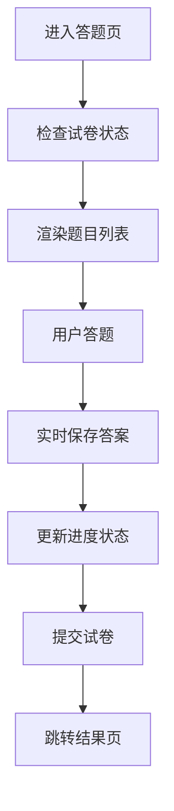
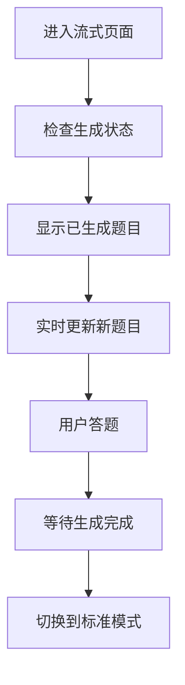
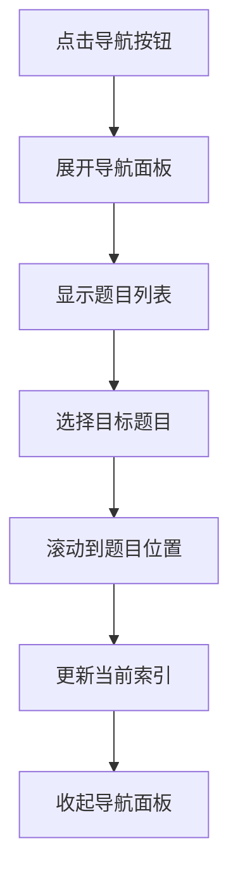

# Quiz 答题页面

答题页面是 QuAIz 应用的核心交互模块，用户在此页面进行答题操作，支持多种题型的答题体验和智能导航功能。

## 📁 目录结构

```
quiz/
├── components/                           # 页面组件
│   ├── EmptyQuizState.tsx               # 空试卷状态
│   ├── QuizHeader.tsx                   # 答题页头部
│   ├── QuizNavigation.tsx               # 题目导航
│   └── index.ts                         # 组件导出
├── docs/                                # 文档目录
│   └── PERFORMANCE_OPTIMIZATION_ANALYSIS.md # 性能优化分析文档
├── hooks/                               # 自定义 Hooks
│   ├── useQuizNavigation.ts            # 题目导航逻辑
│   ├── useQuizStatus.ts                # 答题状态管理
│   ├── useQuizSubmission.ts            # 答题提交逻辑
│   └── index.ts                        # Hooks 导出
├── index.tsx                           # 标准答题页面
├── streaming.tsx                       # 流式答题页面
├── OptimizedStreamingQuizPage.tsx      # 优化版流式答题页面
└── README.md                           # 模块文档
```

## 🎯 核心功能

### 1. 多题型答题支持
- **6 种题型**: 单选、多选、填空、简答、代码输出、代码编写
- **实时保存**: 答案自动保存，防止数据丢失
- **状态管理**: 完整的答题状态跟踪
- **验证反馈**: 实时的答题状态反馈

### 2. 智能导航系统
- **题目导航**: 快速跳转到任意题目
- **进度跟踪**: 实时显示答题进度
- **状态指示**: 已答题/未答题状态标识
- **响应式**: 适配桌面端和移动端

### 3. 流式答题体验
- **实时渲染**: 支持题目生成过程中的实时答题
- **部分显示**: 已生成题目可立即答题
- **进度同步**: 生成进度和答题进度同步显示
- **平滑过渡**: 从生成到答题的无缝切换

## 📋 主要组件

### QuizPage - 标准答题页面
- **文件**: `./index.tsx`
- **功能**: 完整试卷的答题界面
- **特性**:
  - 题目滚动定位
  - 侧边导航面板
  - 答题进度跟踪
  - 提交确认流程
  - 响应式布局

### StreamingQuizPage - 流式答题页面
- **文件**: `./streaming.tsx`
- **功能**: 流式生成试卷的答题界面
- **特性**:
  - 实时题目渲染
  - 生成进度显示
  - 部分内容答题
  - 状态切换处理

### OptimizedStreamingQuizPage - 优化版流式答题页面
- **文件**: `./OptimizedStreamingQuizPage.tsx`
- **功能**: 高性能流式生成试卷的答题界面
- **特性**:
  - 虚拟化渲染优化
  - React.memo 性能优化
  - 事件处理函数缓存
  - 状态计算优化
  - 内存使用优化

### QuizHeader - 答题页头部
- **文件**: `./components/QuizHeader.tsx`
- **功能**: 答题页面的顶部导航栏
- **包含元素**:
  - 试卷标题信息
  - 答题进度显示
  - 当前题目指示
  - 重置按钮

### QuizNavigation - 题目导航
- **文件**: `./components/QuizNavigation.tsx`
- **功能**: 题目导航和状态显示
- **特性**:
  - 题目列表展示
  - 答题状态标识
  - 快速跳转功能
  - 当前题目高亮

### EmptyQuizState - 空试卷状态
- **文件**: `./components/EmptyQuizState.tsx`
- **功能**: 无试卷时的占位显示
- **特性**:
  - 友好的空状态提示
  - 返回操作引导
  - 重新开始按钮

## 🔧 自定义 Hooks

### useQuizNavigation - 题目导航
- **文件**: `./hooks/useQuizNavigation.ts`
- **功能**: 管理题目切换和导航逻辑
- **提供方法**:
  - `goToQuestion(index)` - 跳转到指定题目
  - `currentQuestionIndex` - 当前题目索引

### useQuizStatus - 答题状态
- **文件**: `./hooks/useQuizStatus.ts`
- **功能**: 管理答题状态和进度统计
- **提供数据**:
  - `answeredCount` - 已答题数量
  - `isQuestionAnswered(index)` - 题目是否已答
  - 答题完成度统计

### useQuizSubmission - 答题提交
- **文件**: `./hooks/useQuizSubmission.ts`
- **功能**: 管理答案提交和保存逻辑
- **提供方法**:
  - `handleAnswerChange()` - 答案变更处理
  - `handleSubmitQuiz()` - 提交试卷
  - `isSubmitted` - 提交状态

## 🎮 交互特性

### 导航交互
- **圆形导航按钮**: 固定位置的导航切换按钮
- **可折叠面板**: 题目导航的展开/收起
- **滚动定位**: 自动滚动到选中题目
- **键盘支持**: 支持键盘快捷键导航

### 答题交互
- **实时保存**: 答案变更时自动保存
- **状态反馈**: 即时的答题状态更新
- **验证提示**: 必填项和格式验证
- **确认机制**: 提交前的确认对话框

### 响应式设计
- **桌面端**: 侧边导航面板，大屏幕优化
- **移动端**: 浮动导航按钮，触摸优化
- **自适应**: 根据屏幕尺寸调整布局

## 🔄 页面流程

### 标准答题流程


### 流式答题流程


### 导航交互流程


## 🎨 设计特点

### 用户体验
- **直观导航**: 清晰的题目导航和进度指示
- **流畅切换**: 平滑的题目切换动画
- **状态明确**: 明确的答题状态和进度反馈
- **操作便捷**: 便捷的导航和提交操作

### 视觉设计
- **卡片布局**: 题目采用卡片式布局
- **状态色彩**: 不同状态使用不同颜色标识
- **响应式**: 适配各种屏幕尺寸
- **动画效果**: 适度的过渡动画提升体验

### 技术特性
- **性能优化**: 虚拟滚动和懒加载
- **状态管理**: 基于 Zustand 的状态管理
- **类型安全**: 完整的 TypeScript 支持
- **错误处理**: 完善的错误边界和恢复机制

## 📱 响应式适配

### 桌面端 (lg+)
- **侧边导航**: 固定的侧边导航面板
- **大屏优化**: 充分利用屏幕空间
- **鼠标交互**: 优化的鼠标悬停效果

### 移动端 (< lg)
- **浮动按钮**: 圆形浮动导航按钮
- **触摸优化**: 适合触摸的按钮尺寸
- **滑动支持**: 支持滑动切换题目

## 🔗 数据结构

### 试卷数据结构
```typescript
interface Quiz {
  id: string;
  title: string;
  questions: Question[];
  createdAt: number;
}
```

### 答题状态结构
```typescript
interface AnsweringState {
  currentQuestionIndex: number;
  isSubmitted: boolean;
}
```

### 题目答案结构
```typescript
interface Question {
  id: string;
  type: QuestionType;
  question: string;
  userAnswer?: unknown;  // 用户答案
  // ... 其他题目属性
}
```

## 🔗 相关模块

- **题目组件**: `../../components/Question/` - 题目渲染组件
- **状态管理**: `../../stores/` - 答题状态管理
- **类型定义**: `../../types/` - 共享类型定义
- **结果页面**: `../result/` - 答题完成后的结果页
- **生成页面**: `../generation/` - 试卷生成页面

## 👨‍💻 开发者

- **作者**: JacksonHe04
- **项目**: QuAIz - AI 智能刷题系统
- **模块**: 答题交互核心功能