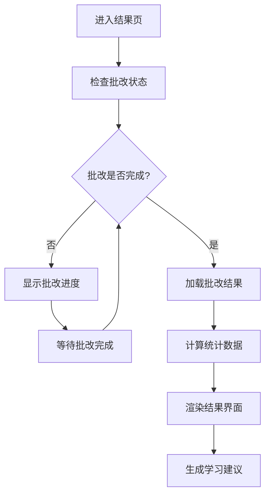
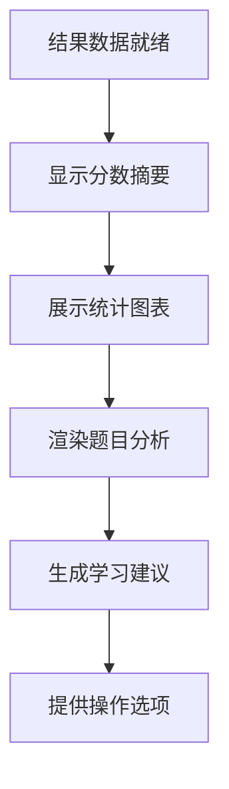
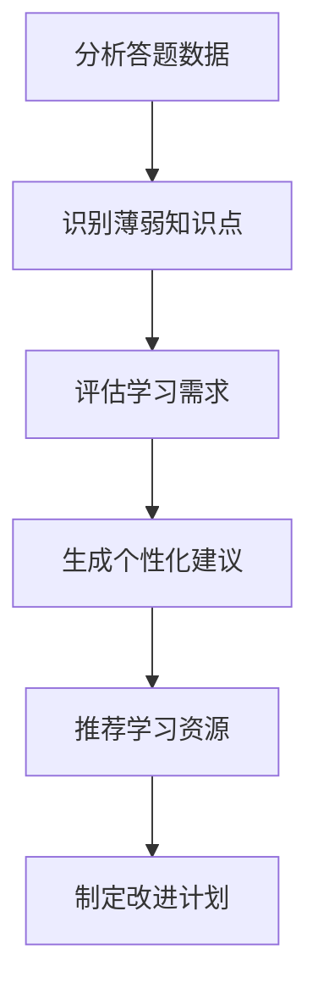

# Result 批改结果页面

批改结果页面是 QGen 应用的成果展示模块，用户在此页面查看 AI 批改结果、学习建议和详细的题目分析，是学习反馈的重要环节。

## 📁 目录结构

```
result/
├── components/                    # 页面组件
│   ├── AnswerComparison.tsx      # 答案对比组件
│   ├── GradingProgress.tsx       # 批改进度组件
│   ├── LearningAdvice.tsx        # 学习建议组件
│   ├── QuestionAnalysis.tsx      # 题目分析组件
│   ├── ResultHeader.tsx          # 结果页头部
│   ├── ResultSummary.tsx         # 结果摘要组件
│   ├── ScoreDisplay.tsx          # 分数显示组件
│   └── index.ts                  # 组件导出
├── hooks/                        # 自定义 Hooks
│   ├── useGradingStatus.ts       # 批改状态管理
│   ├── useResultAnalysis.ts      # 结果分析逻辑
│   └── index.ts                  # Hooks 导出
└── index.tsx                     # 结果页面主组件
```

## 🎯 核心功能

### 1. 智能批改结果展示
- **AI 批改**: 基于 AI 的智能批改和评分
- **详细分析**: 每道题的详细批改分析
- **答案对比**: 用户答案与标准答案对比
- **评分标准**: 透明的评分标准和依据

### 2. 学习建议生成
- **个性化建议**: 基于答题情况的个性化学习建议
- **知识点分析**: 薄弱知识点识别和强化建议
- **学习路径**: 推荐的学习路径和资源
- **改进方向**: 具体的改进建议和方法

### 3. 数据统计分析
- **成绩统计**: 总分、平均分、正确率统计
- **题型分析**: 各题型的得分情况分析
- **时间分析**: 答题时间统计和效率分析
- **趋势跟踪**: 历史成绩趋势对比

## 📋 主要组件

### ResultPage - 结果页面主组件
- **文件**: `./index.tsx`
- **功能**: 批改结果的主要展示界面
- **特性**:
  - 批改状态检查
  - 结果数据加载
  - 组件布局管理
  - 错误状态处理
  - 响应式设计

### ResultHeader - 结果页头部
- **文件**: `./components/ResultHeader.tsx`
- **功能**: 结果页面的顶部信息栏
- **包含元素**:
  - 试卷标题和信息
  - 批改完成时间
  - 操作按钮组
  - 返回导航

### ScoreDisplay - 分数显示组件
- **文件**: `./components/ScoreDisplay.tsx`
- **功能**: 醒目的分数和成绩展示
- **特性**:
  - 大号分数显示
  - 等级评定
  - 进度环形图
  - 动画效果

### ResultSummary - 结果摘要组件
- **文件**: `./components/ResultSummary.tsx`
- **功能**: 整体成绩摘要和统计
- **包含信息**:
  - 总题数和正确数
  - 各题型得分情况
  - 答题时间统计
  - 正确率分析

### QuestionAnalysis - 题目分析组件
- **文件**: `./components/QuestionAnalysis.tsx`
- **功能**: 逐题的详细分析展示
- **特性**:
  - 题目内容展示
  - 批改结果显示
  - 得分和评语
  - 知识点标签

### AnswerComparison - 答案对比组件
- **文件**: `./components/AnswerComparison.tsx`
- **功能**: 用户答案与标准答案对比
- **特性**:
  - 并排对比显示
  - 差异高亮标注
  - 评分依据说明
  - 改进建议

### LearningAdvice - 学习建议组件
- **文件**: `./components/LearningAdvice.tsx`
- **功能**: AI 生成的个性化学习建议
- **特性**:
  - 薄弱知识点分析
  - 学习建议列表
  - 推荐学习资源
  - 改进计划建议

### GradingProgress - 批改进度组件
- **文件**: `./components/GradingProgress.tsx`
- **功能**: 批改过程的进度显示
- **特性**:
  - 实时进度更新
  - 批改状态指示
  - 预计完成时间
  - 错误重试机制

## 🔧 自定义 Hooks

### useGradingStatus - 批改状态管理
- **文件**: `./hooks/useGradingStatus.ts`
- **功能**: 管理批改状态和进度跟踪
- **提供数据**:
  - `gradingStatus` - 当前批改状态
  - `progress` - 批改进度百分比
  - `isCompleted` - 是否批改完成
  - `error` - 批改错误信息

### useResultAnalysis - 结果分析逻辑
- **文件**: `./hooks/useResultAnalysis.ts`
- **功能**: 处理结果数据分析和统计
- **提供方法**:
  - `calculateScore()` - 计算总分和各项得分
  - `analyzePerformance()` - 分析答题表现
  - `generateInsights()` - 生成学习洞察
  - `getWeakAreas()` - 识别薄弱领域

## 🎮 交互特性

### 结果浏览
- **分步展示**: 逐步展示批改结果，增强体验
- **详情切换**: 在摘要和详情视图间切换
- **题目导航**: 快速跳转到特定题目分析
- **展开收起**: 可展开的详细分析内容

### 数据可视化
- **图表展示**: 使用图表展示统计数据
- **进度动画**: 分数和进度的动画效果
- **状态图标**: 直观的正确/错误状态图标
- **颜色编码**: 使用颜色区分不同得分等级

### 操作功能
- **重新答题**: 返回答题页面重新作答
- **查看解析**: 查看题目的详细解析
- **保存结果**: 保存批改结果到本地
- **分享功能**: 分享成绩和学习建议

## 🔄 页面流程

### 批改结果加载流程


### 结果展示流程


### 学习建议生成流程


## 🎨 设计特点

### 视觉层次
- **重点突出**: 分数和关键信息突出显示
- **层次清晰**: 信息按重要性分层展示
- **色彩语义**: 使用语义化颜色表示状态
- **空间布局**: 合理的空间布局和留白

### 用户体验
- **渐进展示**: 分步骤展示结果，避免信息过载
- **交互反馈**: 及时的交互反馈和状态提示
- **个性化**: 基于用户表现的个性化内容
- **可操作性**: 提供明确的后续操作选项

### 数据呈现
- **多维度**: 从多个维度展示学习成果
- **可视化**: 图表和图形化的数据展示
- **对比分析**: 答案对比和历史对比
- **深度分析**: 深入的学习分析和建议

## 📊 数据结构

### 批改结果结构
```typescript
interface GradingResult {
  id: string;
  quizId: string;
  totalScore: number;
  maxScore: number;
  percentage: number;
  questionResults: QuestionResult[];
  summary: ResultSummary;
  learningAdvice: LearningAdvice;
  gradedAt: number;
}
```

### 题目结果结构
```typescript
interface QuestionResult {
  questionId: string;
  score: number;
  maxScore: number;
  isCorrect: boolean;
  feedback: string;
  userAnswer: unknown;
  correctAnswer: unknown;
  analysis: string;
}
```

### 学习建议结构
```typescript
interface LearningAdvice {
  weakAreas: string[];
  recommendations: Recommendation[];
  studyPlan: StudyPlan;
  resources: LearningResource[];
}
```

## 🔄 状态管理

### 批改状态
- **PENDING**: 等待批改
- **IN_PROGRESS**: 批改进行中
- **COMPLETED**: 批改完成
- **FAILED**: 批改失败
- **RETRYING**: 重试中

### 显示状态
- **LOADING**: 加载中
- **SUMMARY**: 摘要视图
- **DETAILED**: 详细视图
- **ANALYSIS**: 分析视图
- **ADVICE**: 建议视图

## 📱 响应式适配

### 桌面端 (lg+)
- **多列布局**: 充分利用屏幕宽度
- **侧边导航**: 固定的题目导航
- **详细展示**: 完整的分析和建议内容

### 移动端 (< lg)
- **单列布局**: 垂直堆叠的内容布局
- **折叠面板**: 可折叠的详细内容
- **触摸优化**: 适合触摸的交互元素

## 🔗 相关模块

- **答题页面**: `../quiz/` - 答题完成后跳转到结果页
- **状态管理**: `../../stores/` - 批改状态和结果数据管理
- **题目组件**: `../../components/Question/` - 题目展示组件
- **日志面板**: `../../components/LogPanel/` - 批改过程日志
- **类型定义**: `../../types/` - 共享类型定义

## 🚀 性能优化

### 数据加载
- **懒加载**: 按需加载详细分析内容
- **缓存策略**: 缓存批改结果避免重复请求
- **分页展示**: 大量题目时的分页处理

### 渲染优化
- **虚拟滚动**: 大量题目时的虚拟滚动
- **组件懒加载**: 按需加载复杂组件
- **图表优化**: 图表组件的性能优化

## 👨‍💻 开发者

- **作者**: JacksonHe04
- **项目**: QGen - AI 智能刷题系统
- **模块**: 批改结果展示和学习建议