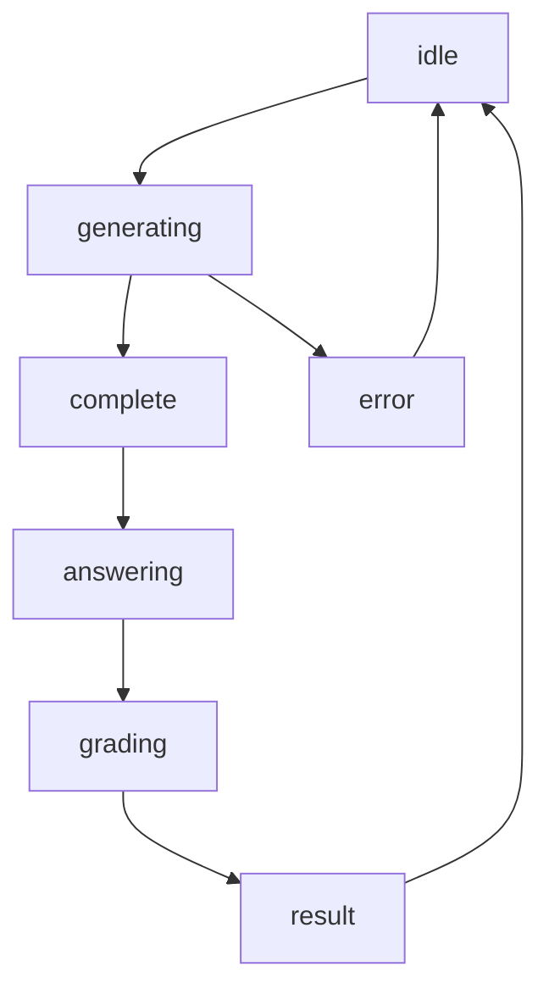

# Stores 状态管理模块

本目录包含 QuAIz 应用的全局状态管理，使用 Zustand 实现轻量级、类型安全的状态管理。

## 📁 目录结构

```
stores/
├── generation/              # 题目生成状态管理
│   ├── actions.ts          # 生成相关 Actions
│   ├── generators.ts       # 题目生成器
│   ├── stateManager.ts     # 状态管理器
│   ├── types.ts           # 类型定义
│   ├── index.ts           # 模块导出
│   └── README.md          # 模块文档
├── logStore/               # 日志状态管理
│   ├── actions.ts         # 日志 Actions
│   ├── logger.ts          # 日志记录器
│   ├── types.ts           # 类型定义
│   ├── utils.ts           # 工具函数
│   ├── index.ts           # 模块导出
│   └── README.md          # 模块文档
├── useAppStore.ts          # 主应用状态 Store
├── useLogStore.ts          # 日志状态 Store
├── timeRecorderStore.ts    # 时间记录状态 Store
├── answeringActions.ts     # 答题相关 Actions
├── gradingActions.ts       # 批改相关 Actions
├── generationActions.ts    # 生成 Actions (兼容性)
├── mockServices.ts         # 模拟服务
└── README.md              # 模块文档
```

## 🎯 核心 Store

### 1. useAppStore - 主应用状态
- **文件**: `./useAppStore.ts`
- **功能**: 管理题目生成、答题和批改的全流程状态
- **状态模块**:
  - `generation`: 题目生成状态
  - `answering`: 答题状态
  - `grading`: 批改状态
- **核心方法**: `resetApp()` - 重置整个应用状态

### 2. useLogStore - 日志状态
- **文件**: `./useLogStore.ts`
- **功能**: 管理全局日志记录和显示
- **特性**:
  - 系统日志记录
  - 流式回复会话管理
  - 日志面板可见性控制
  - 自动清理和限制

### 3. useTimeRecorderStore - 时间记录状态
- **文件**: `./timeRecorderStore.ts`
- **功能**: 管理时间记录和性能监控
- **特性**:
  - 精确的时间记录
  - 实时时长计算
  - 状态可视化
  - 独立状态管理
  - 防抖优化

## 🔧 Actions 模块

### answeringActions - 答题 Actions
- **文件**: `./answeringActions.ts`
- **功能**: 处理答题过程中的状态变更
- **主要方法**:
  - `setCurrentQuestionIndex()` - 设置当前题目索引
  - `updateUserAnswer()` - 更新用户答案
  - `submitQuiz()` - 提交试卷
  - `nextQuestion()` / `previousQuestion()` - 题目导航

### gradingActions - 批改 Actions
- **文件**: `./gradingActions.ts`
- **功能**: 处理试卷批改相关操作
- **主要方法**:
  - `startGrading()` - 开始批改试卷
  - `setGradingError()` - 设置批改错误
  - `resetGrading()` - 重置批改状态
- **工具函数**: 提供得分计算、等级评定等辅助功能

## 📊 Generation 状态管理

### 模块化设计
- **actions.ts**: 生成相关的 Actions 定义
- **generators.ts**: 题目生成器实现
- **stateManager.ts**: 状态管理器类
- **types.ts**: 类型定义

### 核心功能
- **流式生成**: 支持实时显示生成进度
- **错误处理**: 完善的错误状态管理
- **进度跟踪**: 生成进度和完成状态
- **备用方案**: LLM 不可用时的模拟服务

### GenerationStateManager 类
```typescript
class GenerationStateManager {
  setGenerating(): void          // 设置生成中状态
  setError(error: string): void  // 设置错误状态
  updateProgress(progress: number): void  // 更新进度
  addStreamingQuestion(question: StreamingQuestion): void  // 添加流式问题
  setComplete(quiz: Quiz): void  // 设置完成状态
}
```

## 📝 LogStore 日志管理

### 功能特性
- **多类型日志**: 支持不同级别和类别的日志
- **流式会话**: 管理 AI 对话的流式回复
- **自动清理**: 防止内存溢出的自动清理机制
- **可视化**: 配合 LogPanel 组件提供可视化界面

### 日志类型
- **LogEntry**: 系统日志条目
- **StreamSession**: 流式回复会话
- **StreamChunk**: 流式回复片段

### 配置参数
- `MAX_LOGS`: 最大日志数量 (10000)
- `MAX_STREAM_SESSIONS`: 最大流式会话数量 (50)

## 🔄 状态流转

### 题目生成流程


### 状态说明
- **idle**: 空闲状态，等待用户操作
- **generating**: 正在生成题目
- **complete**: 生成完成，可以开始答题
- **error**: 生成失败
- **grading**: 正在批改
- **result**: 批改完成，显示结果

## 🛠️ 工具和服务

### mockServices - 模拟服务
- **文件**: `./mockServices.ts`
- **功能**: LLM 配置不完整时的备用方案
- **特性**:
  - 模拟题目生成
  - 模拟批改服务
  - 支持所有题型
  - 网络延迟模拟

### 题目生成器映射
```typescript
const questionGenerators = {
  'single-choice': createSingleChoiceQuestion,
  'multiple-choice': createMultipleChoiceQuestion,
  'fill-blank': createFillBlankQuestion,
  'short-answer': createShortAnswerQuestion,
  'code-output': createCodeOutputQuestion,
  'code-writing': createCodeWritingQuestion
};
```

## 🎨 设计特点

- **模块化**: 按功能模块组织，便于维护和扩展
- **类型安全**: 完整的 TypeScript 类型定义
- **响应式**: 基于 Zustand 的响应式状态管理
- **可测试**: 纯函数设计，便于单元测试
- **可扩展**: 支持插件式扩展新功能

## 🔗 相关模块

- **页面组件**: `../pages/` - 使用状态的页面组件
- **UI 组件**: `../components/` - 展示状态的 UI 组件
- **LLM 服务**: `../llm/` - 实际的 AI 服务调用
- **类型定义**: `../types/` - 共享的类型定义

## 👨‍💻 开发者

- **作者**: JacksonHe04
- **项目**: QuAIz - AI 智能刷题系统
- **架构**: 基于 Zustand 的模块化状态管理