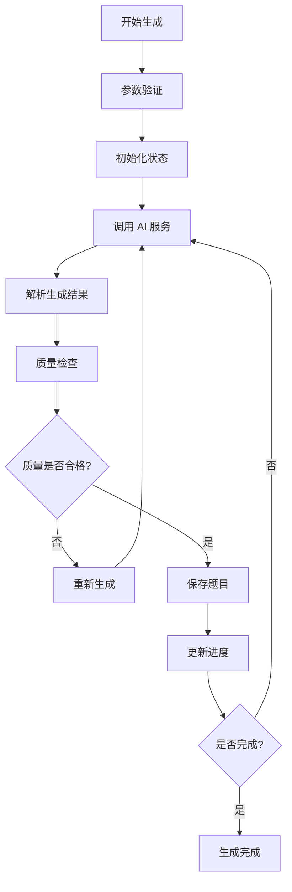
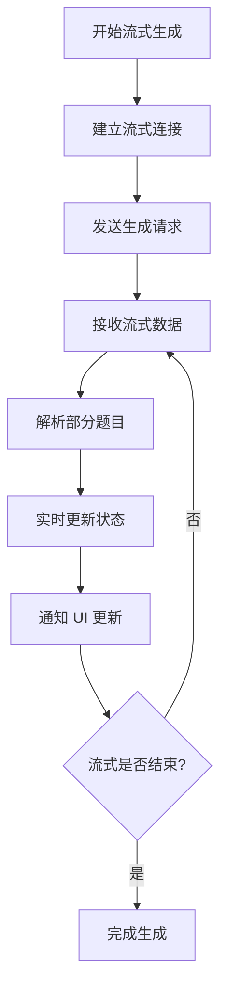
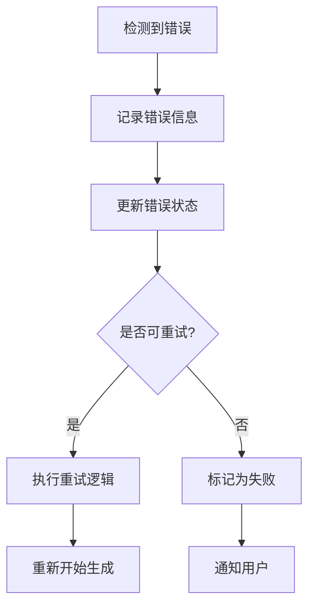
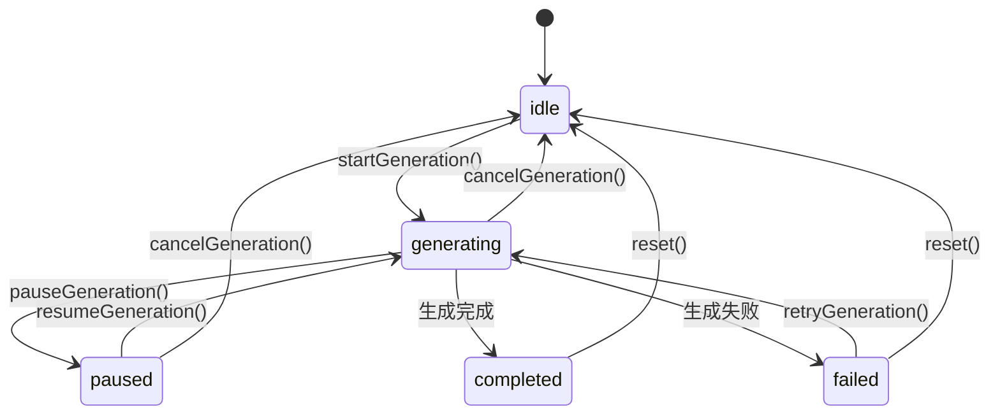
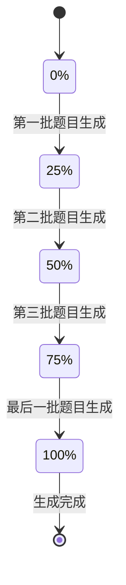

# Generation 题目生成状态管理模块

Generation 模块是 QGen 应用中专门负责题目生成功能的状态管理模块，提供完整的题目生成流程控制、状态管理和数据处理功能。

## 📁 目录结构

```
generation/
├── actions.ts              # 题目生成 Actions
├── generators.ts            # 题目生成器
├── index.ts                # 模块导出
├── stateManager.ts          # 状态管理器
└── types.ts                # 类型定义
```

## 🎯 核心功能

### 1. 智能题目生成
- **AI 驱动**: 基于 AI 的智能题目生成
- **多题型支持**: 支持 6 种不同类型的题目生成
- **流式生成**: 支持流式题目生成和实时展示
- **质量控制**: 题目质量检查和优化

### 2. 生成状态管理
- **状态跟踪**: 完整的生成状态跟踪和管理
- **进度监控**: 实时的生成进度监控
- **错误处理**: 完善的错误处理和重试机制
- **状态持久化**: 生成状态的持久化存储

### 3. 参数配置管理
- **生成参数**: 灵活的生成参数配置
- **预设管理**: 生成预设的保存和管理
- **参数验证**: 生成参数的验证和优化
- **默认配置**: 智能的默认参数配置

## 📋 主要文件

### stateManager.ts - 状态管理器
- **功能**: 题目生成状态的核心管理器
- **特性**:
  - 生成状态的统一管理
  - 状态变更的监听和通知
  - 状态持久化和恢复
  - 状态验证和约束

### actions.ts - 生成 Actions
- **功能**: 题目生成相关的 Action 函数集合
- **提供方法**:
  - `startGeneration()` - 开始题目生成
  - `pauseGeneration()` - 暂停生成过程
  - `resumeGeneration()` - 恢复生成过程
  - `cancelGeneration()` - 取消生成过程
  - `retryGeneration()` - 重试失败的生成

### generators.ts - 题目生成器
- **功能**: 具体的题目生成逻辑实现
- **特性**:
  - 多种生成策略支持
  - 流式生成实现
  - 题目质量检查
  - 生成结果优化

### types.ts - 类型定义
- **功能**: 生成模块的 TypeScript 类型定义
- **定义内容**:
  - 生成参数类型
  - 生成状态类型
  - 题目数据类型
  - API 响应类型

## 🔧 核心 API

### 生成控制 API

```typescript
// 开始生成题目
startGeneration({
  subject: string,
  difficulty: 'easy' | 'medium' | 'hard',
  questionTypes: QuestionType[],
  questionCount: number,
  additionalRequirements?: string
})

// 暂停生成
pauseGeneration()

// 恢复生成
resumeGeneration()

// 取消生成
cancelGeneration()

// 重试生成
retryGeneration()
```

### 状态查询 API

```typescript
// 获取生成状态
const generationState = useGenerationStore(state => state.generationState)

// 获取生成进度
const progress = useGenerationStore(state => state.progress)

// 获取生成参数
const params = useGenerationStore(state => state.generationParams)

// 获取生成结果
const questions = useGenerationStore(state => state.generatedQuestions)
```

### 参数管理 API

```typescript
// 更新生成参数
updateGenerationParams(params: Partial<GenerationParams>)

// 保存生成预设
saveGenerationPreset(name: string, params: GenerationParams)

// 加载生成预设
loadGenerationPreset(presetId: string)

// 删除生成预设
deleteGenerationPreset(presetId: string)
```

## 🎮 生成流程

### 标准生成流程


### 流式生成流程


### 错误处理流程


## 🎨 设计特点

### 状态管理
- **集中管理**: 所有生成相关状态的集中管理
- **响应式**: 基于 Zustand 的响应式状态管理
- **类型安全**: 完整的 TypeScript 类型支持
- **持久化**: 关键状态的持久化存储

### 生成策略
- **多策略**: 支持多种不同的生成策略
- **自适应**: 根据参数自动选择最优策略
- **可扩展**: 易于扩展新的生成策略
- **配置化**: 策略参数的灵活配置

### 错误恢复
- **自动重试**: 智能的自动重试机制
- **降级策略**: 在异常情况下的降级处理
- **状态恢复**: 错误后的状态恢复机制
- **用户反馈**: 清晰的错误信息和用户反馈

## 📊 数据结构

### 生成参数结构
```typescript
interface GenerationParams {
  subject: string;
  difficulty: 'easy' | 'medium' | 'hard';
  questionTypes: QuestionType[];
  questionCount: number;
  additionalRequirements?: string;
  timeLimit?: number;
  language?: 'zh' | 'en';
}
```

### 生成状态结构
```typescript
interface GenerationState {
  status: 'idle' | 'generating' | 'paused' | 'completed' | 'failed';
  progress: number;
  currentStep: string;
  generatedCount: number;
  totalCount: number;
  startTime?: number;
  endTime?: number;
  error?: string;
}
```

### 题目数据结构
```typescript
interface GeneratedQuestion {
  id: string;
  type: QuestionType;
  question: string;
  options?: string[];
  correctAnswer: unknown;
  explanation?: string;
  difficulty: 'easy' | 'medium' | 'hard';
  tags?: string[];
  metadata?: Record<string, unknown>;
}
```

## 🔄 状态流转

### 生成状态流转


### 进度状态流转


## 🚀 性能优化

### 生成优化
- **批量生成**: 批量生成题目提高效率
- **并行处理**: 支持并行生成多个题目
- **缓存机制**: 缓存常用的生成结果
- **预生成**: 预生成常用题目类型

### 内存管理
- **增量更新**: 增量更新生成状态
- **内存清理**: 及时清理不需要的数据
- **数据压缩**: 压缩存储大量题目数据
- **懒加载**: 按需加载题目详细信息

### 网络优化
- **请求合并**: 合并多个生成请求
- **断点续传**: 支持生成过程的断点续传
- **重试策略**: 智能的网络重试策略
- **超时处理**: 合理的请求超时处理

## 🔗 集成方式

### 与页面组件集成
```typescript
// 在生成页面中使用
const GenerationPage = () => {
  const { 
    startGeneration, 
    generationState, 
    progress 
  } = useGenerationStore();
  
  const handleGenerate = (params: GenerationParams) => {
    startGeneration(params);
  };
  
  return (
    <div>
      <GenerationForm onSubmit={handleGenerate} />
      <ProgressBar progress={progress} />
      <StatusDisplay status={generationState.status} />
    </div>
  );
};
```

### 与日志系统集成
```typescript
// 在生成过程中记录日志
export const startGeneration = async (params: GenerationParams) => {
  const { addLogEntry } = useLogStore.getState();
  
  addLogEntry({
    type: 'info',
    message: '开始生成题目',
    metadata: { params }
  });
  
  try {
    // 执行生成逻辑
    await generateQuestions(params);
    
    addLogEntry({
      type: 'info',
      message: '题目生成完成'
    });
  } catch (error) {
    addLogEntry({
      type: 'error',
      message: '题目生成失败',
      metadata: { error }
    });
  }
};
```

### 与主状态管理集成
```typescript
// 与主 Store 的集成
const useAppStore = create<AppState>((set, get) => ({
  // 其他状态...
  
  // 生成相关状态
  currentQuiz: null,
  
  // 生成完成后的处理
  onGenerationComplete: (questions: Question[]) => {
    const quiz = createQuizFromQuestions(questions);
    set({ currentQuiz: quiz });
    
    // 跳转到答题页面
    router.push('/quiz');
  }
}));
```

## 🔗 相关模块

- **生成页面**: `../../pages/generation/` - 题目生成用户界面
- **主状态管理**: `../useAppStore.ts` - 应用主状态管理
- **日志管理**: `../logStore/` - 生成过程日志记录
- **模拟服务**: `../mockServices.ts` - 开发环境模拟服务
- **类型定义**: `../../types/` - 共享类型定义

## 🛠️ 开发工具

### 调试功能
- **状态检查器**: 实时查看生成状态
- **日志追踪**: 详细的生成过程日志
- **性能监控**: 生成性能指标监控
- **错误分析**: 错误原因分析和诊断

### 测试支持
- **模拟生成**: 开发环境的模拟生成功能
- **状态模拟**: 各种生成状态的模拟
- **错误注入**: 错误场景的测试支持
- **性能测试**: 生成性能的测试工具

## 👨‍💻 开发者

- **作者**: JacksonHe04
- **项目**: QGen - AI 智能刷题系统
- **模块**: 题目生成状态管理和流程控制核心功能