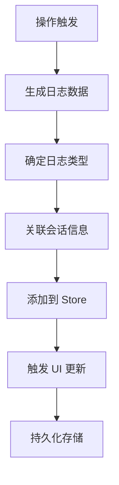
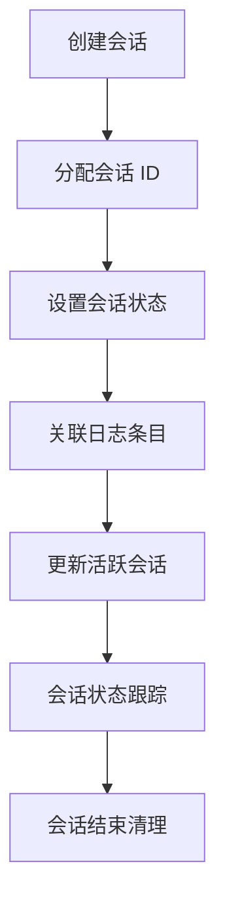
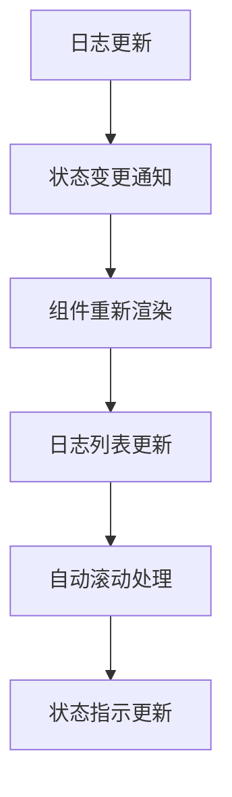

# LogStore 日志管理模块

LogStore 是 QGen 应用的日志管理核心模块，负责收集、存储和展示应用运行过程中的各种日志信息，为用户提供透明的操作反馈和调试信息。

## 📁 目录结构

```
logStore/
├── actions.ts              # 日志操作 Actions
├── index.ts                # 模块导出
├── logEntry.ts             # 日志条目类型定义
├── logStore.ts             # 日志 Store 主体
├── sessionManager.ts       # 会话管理器
└── types.ts                # 类型定义
```

## 🎯 核心功能

### 1. 日志收集与存储
- **多类型日志**: 支持信息、警告、错误、调试等多种日志类型
- **结构化存储**: 结构化的日志数据存储和管理
- **时间戳**: 精确的时间戳记录和排序
- **会话管理**: 按会话组织和管理日志条目

### 2. 实时日志展示
- **实时更新**: 日志条目的实时添加和更新
- **流式显示**: 支持流式内容的实时展示
- **状态跟踪**: 日志条目状态的实时跟踪
- **自动滚动**: 新日志的自动滚动显示

### 3. 会话管理
- **会话创建**: 动态创建和管理日志会话
- **会话切换**: 在不同会话间切换查看
- **会话状态**: 跟踪会话的活跃状态
- **会话清理**: 自动清理过期会话

## 📋 主要文件

### logStore.ts - 日志 Store 主体
- **功能**: 日志状态管理的核心 Store
- **基于**: Zustand 状态管理库
- **特性**:
  - 日志条目的增删改查
  - 会话状态管理
  - 实时更新机制
  - 持久化存储

### actions.ts - 日志操作 Actions
- **功能**: 日志操作的 Action 函数集合
- **提供方法**:
  - `addLogEntry()` - 添加日志条目
  - `updateLogEntry()` - 更新日志条目
  - `clearLogs()` - 清空日志
  - `createSession()` - 创建新会话

### sessionManager.ts - 会话管理器
- **功能**: 管理日志会话的生命周期
- **特性**:
  - 会话创建和销毁
  - 会话状态跟踪
  - 会话数据管理
  - 会话切换逻辑

### logEntry.ts - 日志条目类型
- **功能**: 定义日志条目的数据结构
- **包含属性**:
  - 日志 ID 和时间戳
  - 日志类型和级别
  - 日志内容和元数据
  - 会话关联信息

### types.ts - 类型定义
- **功能**: 日志模块的 TypeScript 类型定义
- **定义内容**:
  - 日志类型枚举
  - 会话状态类型
  - Store 状态接口
  - Action 参数类型

## 🔧 核心 API

### 日志操作 API

```typescript
// 添加日志条目
addLogEntry({
  type: 'info' | 'warning' | 'error' | 'debug',
  message: string,
  sessionId?: string,
  metadata?: Record<string, unknown>
})

// 更新日志条目
updateLogEntry(id: string, updates: Partial<LogEntry>)

// 清空日志
clearLogs(sessionId?: string)

// 删除日志条目
removeLogEntry(id: string)
```

### 会话管理 API

```typescript
// 创建新会话
createSession({
  name: string,
  type: 'generation' | 'grading' | 'general',
  metadata?: Record<string, unknown>
})

// 切换活跃会话
setActiveSession(sessionId: string)

// 结束会话
endSession(sessionId: string)

// 获取会话日志
getSessionLogs(sessionId: string)
```

### 状态查询 API

```typescript
// 获取所有日志
const logs = useLogStore(state => state.logs)

// 获取活跃会话
const activeSession = useLogStore(state => state.activeSession)

// 获取会话列表
const sessions = useLogStore(state => state.sessions)

// 获取日志统计
const stats = useLogStore(state => state.getLogStats())
```

## 🎮 使用场景

### 1. 题目生成日志
- **生成进度**: 记录题目生成的各个阶段
- **API 调用**: 记录与 AI 服务的交互过程
- **错误处理**: 记录生成过程中的错误和重试
- **性能监控**: 记录生成耗时和性能指标

### 2. 批改过程日志
- **批改进度**: 记录批改的进度和状态
- **AI 分析**: 记录 AI 分析和评分过程
- **结果生成**: 记录结果生成和建议生成
- **异常处理**: 记录批改过程中的异常情况

### 3. 用户操作日志
- **页面导航**: 记录用户的页面访问和导航
- **交互操作**: 记录用户的关键操作行为
- **错误反馈**: 记录用户遇到的错误和问题
- **性能数据**: 记录页面加载和响应时间

### 4. 系统运行日志
- **状态变更**: 记录应用状态的重要变更
- **配置更新**: 记录配置和设置的变更
- **资源使用**: 记录内存和性能资源使用
- **调试信息**: 开发和调试过程中的详细信息

## 🔄 数据流程

### 日志生成流程


### 会话管理流程


### 日志展示流程


## 🎨 设计特点

### 性能优化
- **增量更新**: 只更新变更的日志条目
- **虚拟滚动**: 大量日志时的虚拟滚动
- **内存管理**: 自动清理过期日志条目
- **批量操作**: 支持批量添加和更新日志

### 可扩展性
- **插件机制**: 支持自定义日志处理插件
- **格式化器**: 可自定义的日志格式化器
- **过滤器**: 灵活的日志过滤和搜索
- **导出功能**: 支持日志数据的导出

### 类型安全
- **完整类型**: 完整的 TypeScript 类型定义
- **类型推断**: 智能的类型推断和检查
- **接口约束**: 严格的接口约束和验证
- **泛型支持**: 支持泛型的灵活类型定义

## 📊 数据结构

### 日志条目结构
```typescript
interface LogEntry {
  id: string;
  timestamp: number;
  type: 'info' | 'warning' | 'error' | 'debug';
  level: 'low' | 'medium' | 'high' | 'critical';
  message: string;
  sessionId?: string;
  metadata?: Record<string, unknown>;
  status?: 'pending' | 'completed' | 'failed';
}
```

### 会话结构
```typescript
interface LogSession {
  id: string;
  name: string;
  type: 'generation' | 'grading' | 'general';
  createdAt: number;
  updatedAt: number;
  status: 'active' | 'completed' | 'failed';
  metadata?: Record<string, unknown>;
}
```

### Store 状态结构
```typescript
interface LogStoreState {
  logs: LogEntry[];
  sessions: LogSession[];
  activeSessionId: string | null;
  isLoading: boolean;
  error: string | null;
}
```

## 🔗 集成方式

### 与页面组件集成
```typescript
// 在页面组件中使用日志
const { addLogEntry, logs } = useLogStore();

// 记录操作日志
addLogEntry({
  type: 'info',
  message: '开始生成题目',
  sessionId: currentSessionId
});
```

### 与 Actions 集成
```typescript
// 在 Actions 中集成日志
export const generateQuizAction = async (params) => {
  const { addLogEntry } = useLogStore.getState();
  
  addLogEntry({
    type: 'info',
    message: '开始生成题目',
    metadata: { params }
  });
  
  try {
    // 执行生成逻辑
  } catch (error) {
    addLogEntry({
      type: 'error',
      message: '生成失败',
      metadata: { error }
    });
  }
};
```

### 与组件集成
```typescript
// 在组件中展示日志
const LogDisplay = () => {
  const { logs, activeSessionId } = useLogStore();
  
  const sessionLogs = logs.filter(
    log => log.sessionId === activeSessionId
  );
  
  return (
    <div>
      {sessionLogs.map(log => (
        <LogEntryComponent key={log.id} log={log} />
      ))}
    </div>
  );
};
```

## 🔗 相关模块

- **日志面板**: `../../components/LogPanel/` - 日志展示组件
- **主状态管理**: `../useAppStore.ts` - 应用主状态管理
- **生成 Actions**: `../generationActions.ts` - 题目生成操作
- **批改 Actions**: `../gradingActions.ts` - 批改操作
- **答题 Actions**: `../answeringActions.ts` - 答题操作

## 🚀 最佳实践

### 日志记录原则
- **适度记录**: 记录关键操作，避免过度记录
- **结构化**: 使用结构化的日志格式
- **上下文**: 提供充分的上下文信息
- **分级管理**: 合理使用日志级别

### 性能考虑
- **异步处理**: 日志操作使用异步处理
- **批量更新**: 批量处理日志更新
- **内存限制**: 设置合理的内存使用限制
- **清理策略**: 定期清理过期日志

### 错误处理
- **容错机制**: 日志系统本身的容错处理
- **降级策略**: 在异常情况下的降级策略
- **恢复机制**: 错误恢复和重试机制
- **监控告警**: 关键错误的监控和告警

## 👨‍💻 开发者

- **作者**: JacksonHe04
- **项目**: QGen - AI 智能刷题系统
- **模块**: 日志管理和会话跟踪核心功能